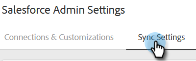

# Configurações de sincronização do Salesforce {#salesforce-sync-settings}

## Logs de atividade de email no Salesforce via API {#logging-email-activity-to-salesforce-via-api}

Essa funcionalidade exige que você esteja na edição Enterprise/Unlimited do Salesforce ou na edição Professional se tiver comprado Integração via API de serviços da Web.

>[!PREREQUISITES]
>
>O Salesforce e o Marketo Sales devem estar conectados.

1. No Marketo Sales, clique no ícone de engrenagem e selecione **Configurações**.

   

1. Em Configurações de administração (ou &quot;Minha conta&quot;, se você não for um administrador), clique em **Salesforce**.

   

1. Clique no botão **Sincronizar configurações** guia .

   

1. Clique na seta ao lado de Registrar atividade de email no Salesforce.

   

1. Clique no botão **API do Salesforce** guia . Neste cartão, você pode configurar sua preferência para registrar informações no Salesforce. Clique em **Salvar** quando concluído.

   

## Registro da atividade de email no Salesforce via email para o Salesforce (Cco) {#logging-email-activity-to-salesforce-via-email-to-salesforce-bcc}

Depois de ativar o &quot;Email to Salesforce (Cco)&quot;, você receberá uma CCO dos emails de vendas e seus emails serão registrados como atividades em oportunidades, clientes potenciais e contatos.

>[!PREREQUISITES]
>
>O Salesforce e o Marketo Sales devem estar conectados.

**Para registrar seus emails no Salesforce via Email (Cco)**

1. No Marketo Sales, clique no ícone de engrenagem e selecione **Configurações**.

   

1. Em Configurações de administração (ou &quot;Minha conta&quot;, se você não for um administrador), clique em **Salesforce**.

   

1. Clique no botão **Sincronizar configurações** guia .

   

1. Clique no botão **Email para Salesforce (Cco)** e clique em **Ativar**.

   

Se, por algum motivo, seu endereço de email para o Salesforce não entrar, siga estas etapas para ativar o recurso Cco em sua conta do Salesforce:

1. Faça logon na instância do Salesforce.
1. Encontre o nome de usuário no canto superior direito e selecione a barra suspensa.
1. Selecionar **Minhas configurações**.
1. Selecionar **Email**.
1. Selecionar **Meu email para o Salesforce**.
1. Nesta página, você verá um campo denominado &quot;Email to Salesforce Address&quot;. Se não houver nada preenchido ao lado dele, role para baixo até &quot;Meus endereços de email aceitos&quot;.
1. Insira os endereços de email que você deseja usar com Cco.
1. Clique em **Salvar alterações**.

**Não é possível localizar meu email no Salesforce em Minhas configurações**

Se você não vir Meu email para o Salesforce em suas Configurações, seu Administrador pode não tê-lo ativado. Isso pode acontecer se sua equipe for nova no Salesforce ou se a equipe nunca tiver usado o endereço CCO fornecido pelo Salesforce.

>[!NOTE]
>
>Você precisará de privilégios de administrador para configurar isso.

1. Clique em **Configuração**.
1. Clique em **Administração de email**.
1. Clique em **Email no Salesforce**.
1. Clique em **Editar**.
1. Marque a caixa ao lado de &quot;Ativo&quot;.
1. Clique em **Salvar**.

## Sincronizar tarefas/lembretes de vendas do Marketo com as tarefas do Salesforce {#sync-marketo-sales-tasks-reminders-to-salesforce-tasks}

1. No Marketo Sales, clique no ícone de engrenagem e selecione **Configurações**.

   

1. Em Configurações de administração (ou &quot;Minha conta&quot;, se você não for um administrador), clique em **Salesforce**.

   

1. Clique no botão **Sincronizar configurações** guia .

   

1. Clique na seta ao lado de Sincronizar tarefas/lembretes de vendas do Marketo para as tarefas do Salesforce.

   

1. Escolha a opção desejada (&quot;Não sincronizar com tarefas do Salesforce&quot; está selecionada por padrão).

   
