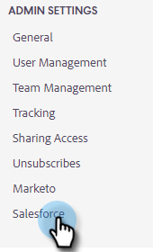

# Sincronizar atividades de vendas com o Salesforce {#sync-sales-activities-to-salesforce}

Você pode configurar as Configurações de sincronização de ações do Salesforce para registrar atividades de email e chamada para o Salesforce. Isso oferece melhor visibilidade às equipes que trabalham com seu CRM e permite que os gerentes usem essas atividades para criar relatórios personalizados do Salesforce a fim de acompanhar o desempenho de suas equipes.

## Registrar atividade de email no Salesforce por meio da API {#logging-email-activity-to-salesforce-via-api}

Essa funcionalidade exige que você esteja na edição Enterprise/Unlimited do Salesforce ou na edição Professional se tiver adquirido a Integração por meio da API dos Serviços da Web.

>[!PREREQUISITES]
>
>As Ações do Salesforce e do Sales Insight devem estar conectadas.

1. Em Ações do Sales Insight, clique no ícone de engrenagem e selecione **Configurações**.

   

1. Em Configurações do Administrador (ou &quot;Minha Conta&quot; se você não for um Administrador), clique em **Salesforce**.

   

1. Clique na guia **Configurações de sincronização**.

   

1. Clique na seta ao lado de Registrar atividade de email no Salesforce.

   

1. Clique na guia **Salesforce API**. Neste cartão, você pode configurar sua preferência para registrar informações no Salesforce. Clique em **Salvar** quando terminar.

   

## Registrar atividade de email no Salesforce por email no Salesforce (Cco) {#logging-email-activity-to-salesforce-via-email-to-salesforce-bcc}

Depois de ativar &quot;Email para Salesforce (Cco)&quot;, você receberá um CCO de seus emails de vendas e seus emails serão registrados como atividades em oportunidades, leads e contatos.

>[!PREREQUISITES]
>
>As Ações do Salesforce e do Sales Insight devem estar conectadas.

**Para registrar seus emails no Salesforce por Email (Cco)**

1. No Marketo Sales, clique no ícone de engrenagem e selecione **Configurações**.

   

1. Em Configurações do Administrador (ou &quot;Minha Conta&quot; se você não for um Administrador), clique em **Salesforce**.

   

1. Clique na guia **Configurações de sincronização**.

   

1. Clique na guia **Email to Salesforce (Cco)** e clique em **Ativar**.

   

Se, por algum motivo, seu endereço de Email para Salesforce não for recebido, siga estas etapas para ativar o recurso CCO na sua conta do Salesforce:

1. Faça logon na sua instância do Salesforce.
1. Encontre seu nome de usuário no canto superior direito e selecione a barra suspensa.
1. Selecione **Minhas Configurações**.
1. Selecione **Email**.
1. Selecione **Meu Email para o Salesforce**.
1. Nessa página, você verá um campo chamado &quot;Endereço de email do Salesforce&quot;. Se não houver nada preenchido ao lado dele, role até &quot;Meus endereços de email aceitáveis&quot;.
1. Digite o(s) endereço(s) de email que deseja Cco.
1. Clique em **Salvar alterações**.

**Não consigo encontrar meu email para a Salesforce em Minhas Configurações**

Se você não vir Meu email para o Salesforce em suas Configurações, talvez o Administrador não o tenha ativado. Isso pode acontecer se sua equipe for nova no Salesforce ou se nunca tiver usado o endereço CCO fornecido pela Salesforce.

>[!NOTE]
>
>Você precisará de privilégios de administrador para configurar isso.

1. Clique em **Instalação**.
1. Clique em **Administração de email**.
1. Clique em **Enviar Email para o Salesforce**.
1. Clique em **Editar**.
1. Marque a caixa ao lado de &quot;Ativo&quot;.
1. Clique em **Salvar**.

## Sincronizar Tarefas/Lembretes de Ações do Insight de Vendas com as Tarefas do Salesforce {#sync-sales-insight-actions-tasks-reminders-to-salesforce-tasks}

1. Em Ações do Sales Insight, clique no ícone de engrenagem e selecione **Configurações**.

   

1. Em Configurações do Administrador (ou &quot;Minha Conta&quot; se você não for um Administrador), clique em **Salesforce**.

   

1. Clique na guia **Configurações de sincronização**.

   

1. Clique na seta ao lado de Sincronizar tarefas/lembretes de vendas do Marketo com tarefas do Salesforce.

   

1. Escolha a opção desejada (&quot;Do not sync to Salesforce tasks&quot; é selecionada por padrão).

   

## Sincronizando pela primeira vez as tarefas de ações do Sales Insight com o Salesforce {#syncing-sales-insight-ations-tasks-with-salesforce-for-the-first-time}

Quando você ativa a sincronização entre as Ações do Sales Insight e as tarefas do Salesforce pela primeira vez, importamos suas tarefas do Salesforce. Não enviaremos nenhuma tarefa atual que você tenha em Ações do Sales Insight para a Salesforce. Para reduzir a desordem e as duplicatas, as únicas tarefas que são sincronizadas das Ações do Sales Insight no Salesforce são tarefas criadas após a sincronização das Ações do Sales Insight com o SFDC.

Veja o que acontece quando você sincroniza Ações do Sales Insight e tarefas do SFDC:

* Assim que você clicar em salvar na sincronização de tarefas, elas começarão a sincronizar. Isso levará algum tempo inicialmente.

* Todos os lembretes atualizados ou criados nas últimas 24 horas serão transferidos do SFDC para as Ações de vendas do Insight. A sincronização é baseada na data de conclusão e todas essas tarefas serão sincronizadas no back-end, mas no Command Center, você só verá tarefas com data de conclusão para hoje e amanhã.

* Se a sincronização tiver sido ativada anteriormente e você excluir qualquer tarefa no SFDC, qualquer item excluído nos últimos 15 dias será excluído do Centro de comando.

* Sincronizaremos tarefas constantemente entre as Ações do Sales Insight e o SFDC, desde que a sincronização esteja habilitada.

* Após a sincronização inicial, todas as tarefas que você criar, editar, concluir ou excluir nas Ações do Sales Insight serão sincronizadas com sua lista de tarefas no Salesforce. Qualquer ação criada, editada, concluída ou excluída no Salesforce atualizará sua lista de tarefas em Ações de vendas do Insight.

* Para ativar essa sincronização, marque a caixa de sincronização na página Configurações no aplicativo Web.
