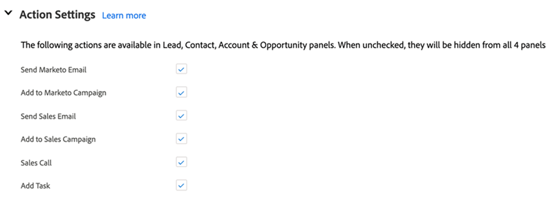

# Configuração de [!DNL Sales Insight Actions] em [!DNL Salesforce] {#sales-insight-actions-configuration-in-salesforce}

>[!PREREQUISITES]
>
>* [Instalar](/help/marketo/product-docs/marketo-sales-insight/msi-for-salesforce/installation/install-marketo-sales-insight-package-in-salesforce-appexchange.md) ou [Atualizar](/help/marketo/product-docs/marketo-sales-insight/msi-for-salesforce/upgrading/upgrading-your-msi-package.md) Pacote do Sales Insight na sua instância [!DNL Salesforce]
>* [Configurar o Marketo Sales Insight em [!DNL Salesforce] Empresa/Ilimitado](/help/marketo/product-docs/marketo-sales-insight/msi-for-salesforce/configuration/configure-marketo-sales-insight-in-salesforce-enterprise-unlimited.md)

## Adicionar Novo Site Remoto em [!DNL Salesforce] {#add-new-remote-site-in-salesforce}

1. Em [!DNL Salesforce], clique em **[!UICONTROL Instalação]**.

   

1. Pesquise por &quot;[!UICONTROL site remoto]&quot; e selecione **[!UICONTROL Configurações de Site Remoto]**.
   

1. Clique em **[!UICONTROL Novo Site Remoto]**.

   

1. Insira o Nome do site remoto (pode ser algo como &quot;MarketoSalesInsight1&quot;). Insira a URL do Site Remoto `https://ims-na1.adobelogin.com` e clique em **[!UICONTROL Salvar]**.

   

1. Clique novamente em **[!UICONTROL Novo Site Remoto]**.

   

1. Insira o Nome do site remoto (pode ser algo como &quot;MarketoSalesInsight2&quot;). Insira a URL do Site Remoto `https://mkto-sales-connect.adobe.io` e clique em **[!UICONTROL Salvar]**.

## Habilitando [!DNL Sales Insight Actions] no CRM {#enabling-sales-insight-actions-across-the-crm}

1. Em [!DNL Salesforce], clique na guia **[!UICONTROL Configuração do Marketo Sales Insight]**.

   

   >[!NOTE]
   >
   >Se você não vir &quot;[!UICONTROL Configuração do Marketo Sales Insight]&quot; em sua barra superior, clique no sinal **+** e localize-o em Todas as Guias.

1. Marque a caixa de seleção **[!UICONTROL Habilitar Ações MSI]**.

   

1. Insira a [!UICONTROL Chave secreta da API].

   

   >[!NOTE]
   >
   >Se você não tiver sua [!UICONTROL Chave de Segurança da API] em mãos, poderá encontrá-la seguindo as etapas descritas em [este artigo](/help/marketo/product-docs/marketo-sales-insight/msi-for-salesforce/configuration/configure-marketo-sales-insight-in-salesforce-enterprise-unlimited.md).

1. Clique em **[!UICONTROL Salvar]** quando terminar.

Isso ativará automaticamente todos os recursos de Ações do MSI descritos no artigo de visão geral do recurso.

>[!NOTE]
>
>Você pode desativar todos os recursos de Ações MSI simplesmente desmarcando a caixa de seleção &quot;Ativar ações MSI&quot;.

## Governação das ações IMS {#msi-actions-governance}

1. Você pode desativar Campanhas de vendas e/ou a guia Tarefa na seção futura. Isso será aplicável aos painéis de cliente potencial, contato, conta e oportunidade.

   

1. Você pode desabilitar Ações MSI ao desmarcar os recursos correspondentes em [!UICONTROL Configurações de ações].

   

>[!NOTE]
>
>As configurações de governança são aplicáveis a todos os usuários de MSI.
