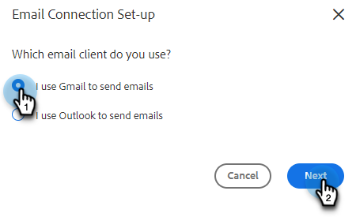

# Conectar ao Gmail {#connect-to-gmail}

Conectar-se ao Gmail significa que você receberá o rastreamento de respostas, o acesso ao canal de entrega do Gmail, a capacidade de agendar emails no Gmail e enviar informações de conformidade.

>[!CAUTION]
>
>Se você está [usando filtros](https://support.google.com/mail/answer/6579?hl=en#zippy=%2Ccreate-a-filter%2Cedit-or-delete-filters){target="_blank"} ou regras em sua conta do Gmail para marcar emails automaticamente como lidos, isso pode causar problemas no rastreamento de respostas. Recomendamos desativar todas as regras que marcam automaticamente os emails como lidos ao usar o rastreamento de resposta com o Gmail.

1. No Marketo Sales, clique no ícone de engrenagem e selecione **Configurações**.

   

1. Em Minha conta, selecione **Configurações de email**.

   

1. Clique na guia **Conexão de email**.

   

1. Clique em **Começar**.

   

1. Selecione **Eu uso o Gmail para enviar emails** e clique em **Avançar**.

   

1. Clique em **OK**.

   

1. Se você já fez logon no Gmail, escolha a conta à qual deseja se conectar. Caso contrário, digite seu endereço do Gmail e clique em **Avançar**. Neste exemplo, ainda não estamos conectados.

   

1. Digite sua senha e clique em **Avançar**.

   

1. Clique em **Permitir**.

   

   Você pode usar essa conexão para rastrear emails e também como um canal de delivery.

>[!NOTE]
>
>O Gmail impõe seus próprios limites de envio. [Saiba mais aqui](/help/marketo/product-docs/marketo-sales-connect/email/email-delivery/email-connection-throttling.md#email-provider-limits).
