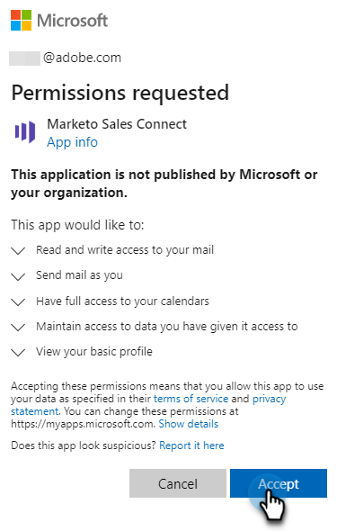

# Conectar ao Outlook {#connect-to-outlook}

Saiba como conectar sua conta de Ações do Sales Insight ao Outlook.

>[!NOTE]
>
>Cada usuário precisa se conectar ao Outlook a partir de sua conta do Marketo Sales.

## Conectando ao Outlook Online {#connecting-to-outlook-online}

Conectar-se ao Outlook significa que você receberá rastreamento de resposta, acesso ao canal de entrega do Outlook, a capacidade de agendar emails no Outlook e enviar conformidade.

1. No Marketo Sales, clique no ícone de engrenagem e selecione **Configurações**.

   

1. Em Minha conta, selecione **Configurações de email**.

   

1. Clique na guia **Conexão de email**.

   

1. Clique em **Começar**.

   

1. Selecione **Eu uso o Outlook para enviar emails** e clique em **Avançar**.

   

1. Selecione a versão do Outlook que você está usando e clique em **Avançar**. Neste exemplo, estamos escolhendo Outlook Online.

   

   <table>
    <tbody>
     <tr>
      <td><strong>Outlook Online</strong></td>
      <td>Também conhecido como Exchange Online</td>
     </tr>
     <tr>
      <td><strong>Exchange no local</strong></td>
      <td>Inclui o Exchange 2013 e 2016</td>
     </tr>
    </tbody>
   </table>

   >[!NOTE]
   >
   >No momento, a Marketo não oferece suporte a contas híbridas do Exchange.

1. Clique em **OK**.

   

1. Se você não estiver conectado ao Outlook, insira suas informações de logon e clique em **Avançar**. Se você estiver, escolha a conta à qual deseja se conectar e clique em **Avançar**. Neste exemplo, já estamos conectados.

   

1. Clique em **Aceitar**.

   

   Você pode usar essa conexão para rastrear emails e também como um canal de delivery.

   >[!NOTE]
   >
   >O Outlook Online (Office365) impõe seus próprios limites de envio. [Saiba mais aqui](/help/marketo/product-docs/marketo-sales-connect/email/email-delivery/email-connection-throttling.md#email-provider-limits).

## Conectando-se ao Exchange no local {#connecting-to-exchange-on-premise}

Conectar-se ao Exchange no local significa que você receberá rastreamento de resposta, acesso ao canal de entrega do Outlook, a capacidade de agendar emails no Outlook e enviar conformidade.

1. No Marketo Sales, clique no ícone de engrenagem e selecione **Configurações**.

   

1. Em Minha conta, selecione **Configurações de email**.

   

1. Clique na guia **Conexão de email**.

   

1. Clique em **Começar**.

   

1. Selecione **Eu uso o Outlook para enviar emails** e clique em **Avançar**.

   

1. Selecione a versão do Outlook que você está usando e clique em **Avançar**. Neste exemplo, estamos escolhendo Exchange no local.

   

   <table>
    <tbody>
     <tr>
      <td><strong>Outlook Online</strong></td>
      <td>Também conhecido como Exchange Online</td>
     </tr>
     <tr>
      <td><strong>Exchange no local</strong></td>
      <td>Inclui o Exchange 2013 e 2016</td>
     </tr>
    </tbody>
   </table>

1. Insira suas credenciais e clique em **Conectar**.

   

   >[!NOTE]
   >
   >Se você desativar a Descoberta Automática no menu suspenso Versão do Exchange, será necessário solicitar ao departamento de TI a URL do Exchange.

   Você pode usar essa conexão para rastrear emails e também como um canal de delivery.

   >[!NOTE]
   >
   >Ao usar o Exchange no local, sua equipe de TI estabelecerá seu limite de envio de email.

## Obtendo Permissão para Conectar-se ao Outlook Online {#getting-permission-to-connect-to-outlook-online}

Talvez seja necessário trabalhar com sua equipe de TI para obter permissão para permitir que o Marketo Sales se conecte à sua conta do Outlook Online (Microsoft 365).

>[!NOTE]
>
>Informe à equipe de TI que gerencia sua conta do Microsoft 365 que o aplicativo que precisa de acesso é o &quot;Marketo Sales Connect&quot;.

Dependendo das preferências da equipe de TI e da configuração atual, é melhor consultar essa equipe sobre como conceder acesso. Abaixo estão alguns artigos que podem ajudar a orientar a conversa.

* Consentimento Global: [Aplicativos integrados e Azure AD para administradores do Microsoft 365](https://learn.microsoft.com/en-us/microsoft-365/enterprise/integrated-apps-and-azure-ads?view=o365-worldwide){target="_blank"}
* Consentimento do Usuário: [Configurar como os usuários consentem aos aplicativos](https://learn.microsoft.com/en-us/azure/active-directory/manage-apps/configure-user-consent?tabs=azure-portal&pivots=portal){target="_blank"}
* Consentimento do administrador: [Configurar o fluxo de trabalho de consentimento do administrador](https://learn.microsoft.com/en-us/microsoft-365/admin/misc/user-consent?source=recommendations&view=o365-worldwide){target="_blank"}
* Ativando ou desativando o consentimento do usuário: [Gerenciando o consentimento do usuário para aplicativos no Microsoft 365](https://learn.microsoft.com/en-us/microsoft-365/admin/misc/user-consent?source=recommendations&view=o365-worldwide){target="_blank"}
* Gerenciando com o Microsoft Defender: [Gerenciar aplicativos OAuth](https://learn.microsoft.com/en-us/defender-cloud-apps/manage-app-permissions){target="_blank"}
