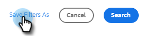

# Visão geral da pesquisa avançada {#advanced-search-overview}

Ao utilizar a pesquisa avançada para direcionar clientes potenciais que visualizaram, clicaram ou responderam a emails, é possível criar uma lista direcionada dos seus clientes potenciais mais envolvidos.

## Como acessar a pesquisa avançada {#how-to-access-advanced-search}

1. No aplicativo Web, clique em **[!UICONTROL Centro de Comando]**.

   

1. Clique em **[!UICONTROL Emails]**.

   

1. Escolha a guia aplicável.

   

1. Clique em [!UICONTROL Pesquisa Avançada].

   

## Filtros {#filters}

**Data**

Escolha o intervalo de datas da pesquisa. Atualizações de datas predefinidas dependendo do status do email escolhido ([!UICONTROL Enviado], [!UICONTROL Não entregue], [!UICONTROL Pendente]).

**Quem**

Filtrar por destinatário/remetente do email na seção [!UICONTROL Quem].

<table>
 <tr>
  <td><strong>Suspenso</strong></td>
  <td><strong>Descrição</strong></td>
 </tr>
 <tr>
  <td><strong>[!UICONTROL Exibir Como]</strong></td>
  <td>Filtrar por um remetente específico na instância do Sales Connect (essa opção está disponível somente para administradores).</td>
 </tr>
 <tr>
  <td><strong>[!UICONTROL Por Grupo]</strong></td>
  <td>Filtre emails por um grupo específico de recipients.</td>
 </tr>
 <tr>
  <td><strong>[!UICONTROL Por Pessoa]</strong></td>
  <td>Filtrar por um recipient específico.</td>
 </tr>
</table>

**Quando**

Escolha por data de criação, data de entrega, data de falha ou data programada. As opções disponíveis mudam, dependendo do status do email escolhido ([!UICONTROL Enviado], [!UICONTROL Não entregue], [!UICONTROL Pendente]).

**Campanhas**

Filtrar emails por participação na campanha.

**Status**

Há três status de email para escolher. As opções de tipo/atividade mudam com base no status selecionado.

_**Status: Enviado**_

Filtros de acordo com a atividade de email enviada. Você pode escolher [!UICONTROL exibições]/[!UICONTROL nenhuma exibição], [!UICONTROL cliques]/[!UICONTROL nenhum clique] e/ou [!UICONTROL respostas]/[!UICONTROL nenhuma resposta].

_**Status: Pendente**_

Filtra por todos os emails pendentes.

<table>
 <tr>
  <td><strong>Status</strong></td>
  <td><strong>Descrição</strong></td>
 </tr>
 <tr>
  <td><strong>[!UICONTROL Agendado]</strong></td>
  <td>Emails que foram agendados na janela de composição (Salesforce ou o Aplicativo Web), em plug-ins de email ou em uma campanha.</td>
 </tr>
 <tr>
  <td><strong>[!UICONTROL Rascunhos]</strong></td>
  <td>Emails que estão atualmente em estado de rascunho. Os emails exigem uma linha de assunto e um recipient para serem salvos como rascunho.</td>
 </tr>
 <tr>
  <td><strong>[!UICONTROL Em Andamento]</strong></td>
  <td>Emails que estão sendo enviados. Os emails não devem permanecer nesse estado por mais do que alguns segundos.</td>
 </tr>
</table>

_**Status: não entregue**_

Filtra por emails que nunca foram entregues.

<table>
 <tr>
  <td><strong>Status</strong></td>
  <td><strong>Descrição</strong></td>
 </tr>
 <tr>
  <td><strong>[!UICONTROL Falha]</strong></td>
  <td>Quando um email não é enviado pelo Sales Connect (motivos comuns incluem: emails sendo enviados para contatos com assinatura cancelada/bloqueados ou se houve um problema ao preencher os campos dinâmicos).</td>
 </tr>
 <tr>
  <td><strong>[!UICONTROL Devolvido]</strong></td>
  <td>Um email é marcado como rejeitado quando for rejeitado pelo servidor do destinatário. Somente os emails enviados pelos servidores do Sales Connect serão mostrados aqui.</td>
 </tr>
 <tr>
  <td><strong>[!UICONTROL Spam]</strong></td>
  <td>Quando o email foi marcado como spam (termo comum para email não solicitado) pelo recipient. Somente os emails enviados pelos servidores do Sales Connect serão mostrados aqui.</td>
 </tr>
</table>

## Pesquisas salvas {#saved-searches}

Veja como criar uma pesquisa salva.

1. Depois que todos os filtros estiverem implementados, clique em **[!UICONTROL Salvar Filtros Como]**.

   

1. Dê um nome à sua pesquisa e clique em **[!UICONTROL Salvar]**.

   

Suas pesquisas salvas estarão na barra lateral à esquerda.

