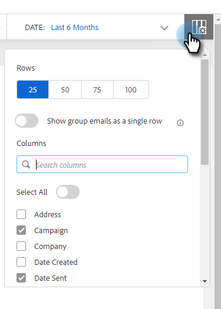

# Colunas de e-mail e layout da página de e-mail {#email-columns-and-email-page-layout}

Você pode configurar qualquer uma das colunas disponíveis para serem visíveis na seção de email do [Centro de comando](/help/marketo/product-docs/marketo-sales-insight/actions/email/command-center/command-center-overview.md). Suas configurações serão salvas para cada subpasta de email (por exemplo, Entregue, Com falha, Agendado etc.).

## Colunas de email {#email-columns}

<table> 
 <colgroup> 
  <col> 
  <col> 
 </colgroup> 
 <tbody> 
  <tr> 
   <th>Coluna</th> 
   <th>Descrição</th> 
  </tr> 
  <tr> 
   <td><strong>Pessoa</td> 
   <td>Nome e email da pessoa no Sales Connect. Clicar nesse campo abrirá a guia Sobre na exibição de detalhes da pessoa.</td> 
  </tr> 
  <tr> 
   <td><strong>Nome</td> 
   <td>Nome da pessoa no Sales Connect.</td> 
  </tr> 
  <tr> 
   <td><strong>Endereço</td> 
   <td>Endereço de email principal da pessoa no Sales Connect.</td> 
  </tr> 
  <tr> 
   <td><strong>Campanha</td> 
   <td>Se o email foi enviado como parte de uma campanha, mostrará o nome da campanha. Clicar nesse campo o levará à página de configuração dessa campanha.</td> 
  </tr> 
  <tr> 
   <td><strong>Modelo</td> 
   <td>Mostra o nome do modelo (se o email foi enviado com um).</td> 
  </tr> 
  <tr> 
   <td><strong>Assunto</td> 
   <td>Linha de assunto do email.</td> 
  </tr> 
  <tr> 
   <td><strong>Grupos</td> 
   <td>Mostra os grupos aos quais o destinatário do email pertence.</td> 
  </tr> 
  <tr> 
   <td><strong>Nome do cargo</td> 
   <td>Título do destinatário do email.</td> 
  </tr> 
  <tr> 
   <td><strong>Empresa</td> 
   <td>Empresa do destinatário do email.</td> 
  </tr> 
  <tr> 
   <td><strong>Status do e-mail</td> 
   <td>Status em que o email está. Os status incluem: Rascunho, Programado, Em andamento, Spam, Devolvido, Com falha, Enviado. Os emails enviados mostrarão um fluxo de atividade que mostra quantas visualizações, cliques e respostas ocorreram nesse email.</td> 
  </tr> 
  <tr> 
   <td><strong>Data de criação</td> 
   <td>Data de criação do email.</td> 
  </tr> 
  <tr> 
   <td><strong>Última atualização</td> 
   <td>Data da última atualização do email.</td> 
  </tr> 
  <tr> 
   <td><strong>Canal de entrega</td> 
   <td>O nome do canal de entrega usado para enviar o email.</td> 
  </tr> 
  <tr> 
   <td><strong>Última atividade</td> 
   <td>O último envolvimento do destinatário do email (por exemplo, exibir, clicar ou responder).</td> 
  </tr> 
  <tr> 
   <td><strong>Data do envio</td> 
   <td>A data em que o email foi enviado.</td> 
  </tr> 
  <tr> 
   <td><strong>Ações de acompanhamento</td> 
   <td>Botões de ação rápida que podem ser usados para acompanhamento por email, telefone, inMail ou tarefa.</td> 
  </tr> 
  <tr> 
   <td><strong>E-mail grupal</td> 
   <td>Exibe uma marca de seleção se o email foi enviado como parte de um Email de grupo.</td> 
  </tr> 
  <tr> 
   <td><strong>Data de vencimento da tarefa</td> 
   <td>Mostra a data de conclusão das tarefas relacionadas ao email. As tarefas podem ser relacionadas a um email sendo criadas a partir dos botões de ação rápida na lista de email.</td> 
  </tr> 
  <tr> 
   <td><strong>Ação de e-mail</td> 
   <td>Botões de ação rápida que podem ser usados para executar ações no email. Dependendo do status do email, as seguintes ações podem estar disponíveis: Arquivar, Êxito, Excluir, Repetir envio, Desarquivar.</td> 
  </tr> 
  <tr> 
   <td><strong>Tipo de tarefa</td> 
   <td>Mostra o tipo de tarefa de uma tarefa relacionada ao email. As tarefas podem ser relacionadas a um email sendo criadas a partir dos botões de ação rápida na lista de email.</td> 
  </tr> 
  <tr> 
   <td><strong>Data da falha</td> 
   <td>Mostra a data em que o email falhou se o email não foi entregue.</td> 
  </tr> 
 </tbody> 
</table>

## Configurações de layout de página de e-mail {#email-page-layout-settings}

Você pode configurar o layout seguindo estas etapas.

1. No aplicativo Web, clique em **Centro de Comando**.

   

1. Selecione a seção **Emails**.

   

1. Clique no botão de configuração. Suas opções incluem: escolher quantas linhas você deseja, selecionar quais campos deseja exibir e selecionar se deseja que os emails de grupo sejam acumulados em um único item na grade (ou se deseja que todos os emails que fazem parte de uma grade de email sejam exibidos como um único item).

   

1. Basta clicar fora da caixa de configuração quando terminar para salvar as alterações.
