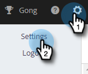

# Limitação da conexão de email {#email-connection-throttling}

Integrar sua conta do Sales Connect para enviar por meio de provedores de email do Exchange ou Gmail oferece uma configuração simplificada e otimiza a capacidade de fornecimento de email para comunicação de vendas 1:1. No entanto, para manter os sistemas íntegros e as contas seguras, o Gmail e o Exchange impõem limites de envio de email. Estes limites podem ser aumentados ou diminuídos à discrição dos prestadores.

## Limitação da conexão de email (Beta) {#email-connection-throttling-beta}

>[!AVAILABILITY]
>
>Esse recurso está atualmente na versão beta. Para participar deste Beta, entre em contato com o Gerente de sucesso do cliente.

A Limitação da conexão de email permite que os administradores do Sales Connect configurem a taxa de envio de emails ao usar o Gmail ou o Exchange como seu canal de delivery, de modo que a taxa na qual os emails são entregues ao provedor de canal de delivery não exceda os limites impostos.

Quando os limites são consistentemente excedidos, isso pode, às vezes, ser visto como um comportamento suspeito do provedor de canal de delivery, fazendo com que os emails falhem e, às vezes, até mesmo uma conta seja desabilitada.

**Notas/destaques**

* Automaticamente ativado assim que um usuário se conecta ao Gmail ou ao Exchange
* Pode ser personalizado se você quiser aumentar ou diminuir as configurações da recomendação para atender às suas necessidades
* Limita somente emails enviados por meio do Gmail ou do Exchange, não limita o uso de canais de delivery personalizados
* O controle de Conexão de email enfileira cada email de usuário individual separadamente, pois cada usuário tem sua própria conexão com seu provedor de email

**Configurar as configurações de limitação da conexão de email**

1. Clique no ícone de engrenagem e selecione **Configurações**.

   

1. Em Configurações de administração, clique em **Geral**.

   

1. No cartão de Limitação da conexão de email à direita, clique no botão **Ativar limitação de e-mail** controle deslizante.

   

1. No cartão Limitação da conexão de email à direita, digite o tamanho do lote desejado de emails que serão enviados para o provedor de canal de email.

   

1. Defina o tempo de espera para que cada lote seja enviado. Neste exemplo, estamos escolhendo 25 emails a cada 45 segundos.

   

1. Clique em **Salvar**.

   

Com as alterações salvas, todos os usuários terão seus emails enviados em lotes para sua conta Gmail ou Exchange conectada para entrega.

## Limites do provedor de email {#email-provider-limits}

**Outlook 365**

Negócios/Empreendimentos

* 10.000 por dia
* 30 por minuto
* 500 recipients por email

Mais informações [pode ser encontrada aqui](https://docs.microsoft.com/en-us/office365/servicedescriptions/exchange-online-service-description/exchange-online-limits?redirectedfrom=MSDN#RecipientLimits).

**Gmail**

* 2000 por dia (500 para avaliação e contas sinalizadas)
* 2 emails por segundo (Limite da API)
* 2.000 recipients por mensagem (máximo de 500 para recipients externos)

Mais informações [pode ser encontrada aqui](https://support.google.com/a/answer/166852?hl=en).

**Microsoft Exchange Server (2010, 2013)**

Os limites são definidos pelo departamento de TI da organização, à medida que o servidor é hospedado pela organização. Entre em contato com o administrador da rede ou do sistema, conforme aplicável, para obter mais informações.

>[!MORELIKETHIS]
>
>* [Visão geral do canal de delivery](/help/marketo/product-docs/marketo-sales-connect/email/email-delivery/delivery-channel-overview.md)
>* [Conexão de email para usuários do Gmail](/help/marketo/product-docs/marketo-sales-connect/email-plugins/gmail/email-connection-for-gmail-users.md)
>* [Conexão de email para usuários do Outlook](/help/marketo/product-docs/marketo-sales-connect/email-plugins/msc-for-outlook/email-connection-for-outlook-users.md)

