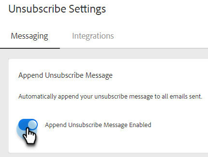

# Configuração de Mensagem de Cancelamento de Inscrição de Anexação Automática {#auto-append-unsubscribe-message-setting}

Certifique-se de que cada email de ações de Insight de vendas enviado inclua uma mensagem de cancelamento de inscrição para que os destinatários tenham uma opção fácil de não se comunicar. Quando a opção anexar mensagem de cancelamento de inscrição estiver ativada, todas as comunicações que sua equipe enviar do Marketo Sales incluirão uma mensagem de cancelamento de inscrição, incluindo emails enviados do aplicativo web e do Salesforce.

>[!NOTE]
>
>Se você usar o `{{team_unsubscribe}}` se o campo dinâmico em um modelo de email e a configuração de acréscimo da mensagem de cancelamento de inscrição estiverem ativados, o campo dinâmico de cancelamento de inscrição da equipe preencherá a mensagem de cancelamento de inscrição _em vez de_ anexando a mensagem de cancelamento de inscrição.

## Habilitar/Desabilitar Anexar Cancelamento de Inscrição {#enable-disable-unsubscribe-append}

1. Clique no ícone de engrenagem e selecione **Configurações**.

   

1. Em Configurações Do Administrador, Clique Em **Cancelamentos de assinatura**.

   

1. Na guia Mensagens, em Anexar mensagem de cancelamento de inscrição, mova o controle deslizante para o estado desejado.

   

>[!TIP]
>
>Se você desativar a configuração Anexar mensagem de cancelamento de inscrição, recomendamos adicionar um rodapé de cancelamento de inscrição aos modelos para garantir que a comunicação tenha uma opção de recusa. Você pode fazer isso adicionando sua própria mensagem personalizada a cada modelo ou usando `{{team_unsubscribe}}` [campo dinâmico](/help/marketo/product-docs/marketo-sales-insight/actions/templates/dynamic-fields.md){target="_blank"}.
