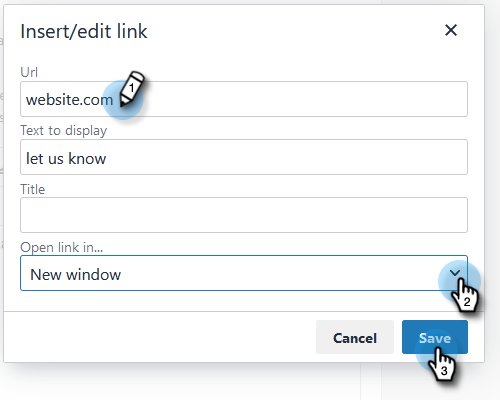

# Personalizar mensagem do link de cancelamento de inscrição {#customize-unsubscribe-link-message}

Sempre permitimos que as equipes personalizem as mensagens de link de cancelamento de inscrição, mas os administradores têm a opção de definir as mensagens de link de cancelamento de inscrição para toda a equipe, a fim de garantir mensagens consistentes.

>[!NOTE]
>
>Não é possível usar um link de cancelamento de inscrição de terceiros com [!DNL Marketo Sales], pois essas informações não serão capturadas no nosso banco de dados.

1. Clique no ícone de engrenagem e selecione **[!UICONTROL Configurações]**.

   

1. Em [!UICONTROL Configurações de Administração], clique em **[!UICONTROL Cancelar Assinaturas]**.

   

1. Determine se esta mensagem será o padrão para toda a equipe ou se você deseja permitir que a equipe crie suas próprias mensagens (neste exemplo, estamos escolhendo mensagens padrão). Escreva suas mensagens personalizadas na caixa de texto.

   

1. Realce o texto no qual você deseja que as pessoas cliquem para acessar a página de cancelamento de inscrição e clique no ícone de link.

   

   >[!NOTE]
   >
   >Não importa o URL inserido. Quando o email é enviado, o primeiro (ou único) hiperlink é vinculado automaticamente à página de cancelamento de inscrição padrão.

1. Insira uma URL, determine se deseja que o link seja aberto na janela atual ou em uma nova janela e clique em **[!UICONTROL Salvar]**.

   

1. Clique em **[!UICONTROL Salvar]** na parte inferior para salvar as alterações.

   
