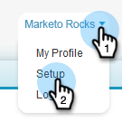

# Sincronização de cancelamentos de assinatura com o Salesforce {#syncing-unsubscribes-with-salesforce}

Se você quiser sincronizar cancelamentos de assinatura com um campo de recusa no Salesforce, você pode usar a sincronização de cancelamento de assinatura do Salesforce.

## Requisitos para cancelamentos de assinatura para sincronização com o Salesforce {#requirements-for-unsubscribes-to-sync-to-salesforce}

* A sincronização de cancelamento de inscrição deve estar habilitada (para sincronização noturna)
* O campo Recusar deve estar instalado no Salesforce
* Os registros de pessoa no Marketo Sales devem ter uma ID do Salesforce

**Cancelamentos de Assinatura por Push**

Quando um cancelamento de inscrição é coletado no Marketo Sales, enviamos para o Salesforce em tempo real e atualizamos qualquer um dos campos de opção de não participação que você selecionou para sincronização. Se você desativou a sincronização do Salesforce, ainda enviaremos o cancelamento de inscrição para a opção de não participação de email.

**Cancelar Assinatura da Sincronização**

Após habilitar a sincronização de cancelamento de inscrição (Etapa 3 abaixo), você ativará a sincronização noturna. A sincronização ocorre uma vez por dia, por volta das 20h PST. Ele sincronizará bidirecionalmente todas as cancelamentos de subscrições no Marketo Sales com o campo Recusa no Salesforce.

>[!NOTE]
>
>A sincronização de cancelamento de inscrição com o Salesforce sincronizará cancelamentos de inscrição, mas não sincronizará reinscrições. Se quiser remover um cancelamento de assinatura do Marketo Sales e do Salesforce, desmarque o cancelamento de assinatura no Salesforce e remova-o no Marketo Sales.

## Configurar cancelar inscrição da sincronização com o Salesforce {#configure-unsubscribe-sync-to-salesforce}

Os usuários podem decidir se desejam sincronizar seus cancelamentos de assinatura com o campo Email Opt Out padrão, com o qual o Marketo também pode sincronizar, ou podem sincronizar com o campo Marketo Sales Opt Out para que os cancelamentos de assinatura de vendas e de marketing possam ser diferenciados.

1. Clique no ícone de engrenagem e selecione **Configurações**.

   

1. Em Configurações do administrador, selecione **Cancelar assinatura**.

   

1. Clique na guia **Integrações**. Em Sincronizar com o Salesforce, habilite a sincronização noturna.

   

1. Selecione o campo que você deseja sincronizar.

   

   | Campo | Descrição |
   |---|---|
   | **Sincronizar com o campo Recusa do Salesforce** | Selecionado por padrão, atualiza somente o campo Recusa do Salesforce. |
   | **Sincronizar com o campo Recusa do Marketo Sales** | Se quiser separar cancelamentos de assinatura de Vendas e Marketing, escolha esta opção para atualizar o campo [Recusa/aceitação de vendas do Marketo.](#msoo) |

## Instalação do campo Recusa no layout da página {#installing-the-opt-out-field-in-the-page-layout}

**Opção de não participação de email**

Recusa de email é um campo padrão no Salesforce que está disponível para instalação no Salesforce. Você precisa ser um administrador do Salesforce para instalá-lo.

1. Acesse o [Salesforce.com](https://salesforce.com) e faça logon.

   

1. Clique no seu nome de usuário e selecione **Instalação**.

   

1. Na caixa de localização rápida, procure por Contato ou Cliente Potencial. Neste cenário, estamos instalando o campo no layout da página Contato, mas convém instalar para ambos os registros de pessoa.

   

1. Selecione **Layouts de Página**.

   

1. Selecione **Editar** ao lado do layout de página ao qual você deseja adicionar o campo.

   

1. Selecione **Campos**.

   

1. Arraste e solte Recusa de email no layout da página.

   

1. Clique em **Salvar**.

   

## Desativação de Marketo Sales {#marketo-sales-opt-out}

O campo Recusa de vendas do Marketo é um campo personalizado disponível para usuários que instalaram o pacote do Marketo Sales Insight [do AppExchange](/help/marketo/product-docs/marketo-sales-insight/msi-for-salesforce/installation/install-marketo-sales-insight-package-in-salesforce-appexchange.md){target="_blank"}.

Depois de instalar com êxito o pacote Marketo Sales Insight do AppExchange no Salesforce, você verá o campo Marketo Sales Opt Out disponível para você.
