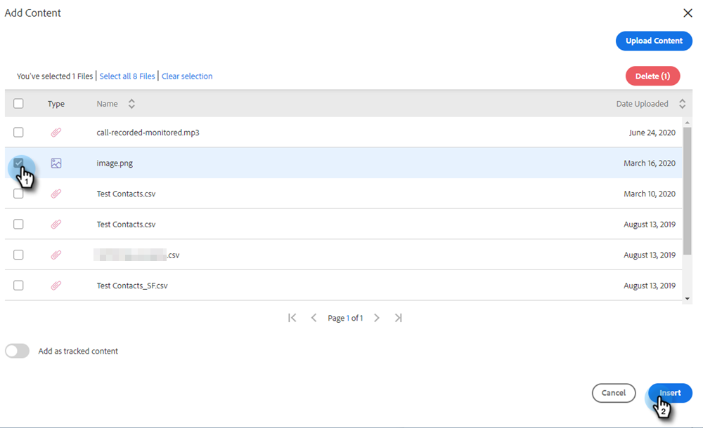
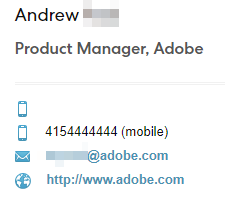

# Adicionar um anexo ou conteúdo rastreável ao seu email {#add-an-attachment-or-trackable-content-to-your-email}

Ao enviar um email por meio do [!DNL Marketo Sales], você tem a opção de adicionar um arquivo como anexo ou tornar um arquivo um link baixável (e rastreável).

>[!NOTE]
>
>Normalmente, qualquer arquivo com mais de 20 MB será muito grande para ser entregue. O tamanho de um anexo que você pode enviar por email varia de acordo com o canal de delivery de email que você está usando.

## Adicionar um anexo {#add-an-attachment}

1. Crie seu rascunho de email (há várias maneiras de fazer isso, neste exemplo, estamos escolhendo **[!UICONTROL Compor]** no cabeçalho).

   

1. Preencha o campo [!UICONTROL Para] e insira um [!UICONTROL Assunto].

   

1. Clique no ícone de anexo.

   

1. Selecione o arquivo que deseja anexar e clique em **[!UICONTROL Inserir]**.

   

   >[!NOTE]
   >
   >Se precisar carregar um arquivo, clique no botão **[!UICONTROL Carregar conteúdo]** no canto superior direito da janela.

   O anexo aparece na parte inferior do email.

   

## Adicionar conteúdo rastreável {#add-trackable-content}

1. Crie seu rascunho de email (há várias maneiras de fazer isso; neste exemplo, estamos escolhendo a janela **[!UICONTROL Compor]**).

   

1. Preencha o campo [!UICONTROL Para] e insira um [!UICONTROL Assunto].

   

1. Clique no ponto no e-mail em que deseja que o conteúdo rastreável apareça e clique no ícone de anexo.

   

1. Selecione o conteúdo que você deseja adicionar, clique no controle deslizante **[!UICONTROL Conteúdo é rastreado]** e clique em **[!UICONTROL Inserir]**.

   

   >[!NOTE]
   >
   >Se precisar carregar um arquivo, clique no botão **[!UICONTROL Carregar conteúdo]** no canto superior direito da janela.

   O conteúdo aparece como um link em seu email. O recipient pode clicar no link para baixar o conteúdo.

   

   >[!NOTE]
   >
   >Os usuários serão notificados no Feed ao vivo quando as pessoas estiverem visualizando o conteúdo rastreado. Os usuários também podem ver o conteúdo de maior desempenho na seção de conteúdo da página do Analytics.

## Atualizações de conteúdo rastreável {#trackable-content-updates}

**Visualizador de Conteúdo Rastreável**

Quando um cliente potencial clica em um conteúdo rastreável no seu email, ele abre um visualizador de conteúdo.

No visualizador de conteúdo, os clientes em potencial podem fazer as seguintes coisas.

* Baixar o documento

* Percorrer o documento

* Exibir as informações de contato do remetente

**Eventos de Conteúdo Rastreável no Feed Dinâmico**

Quando um lead clicar no link do nosso documento, você verá um evento de clique. Você pode clicar nesse link para visualizar o conteúdo. Desde que você esteja conectado à sua conta de Ações no navegador, não contaremos esses cliques como eventos.

Cada vez que o lead avançar para outra página no documento, você receberá um evento Visualizado no Feed ao vivo que mostra o nome do documento.
