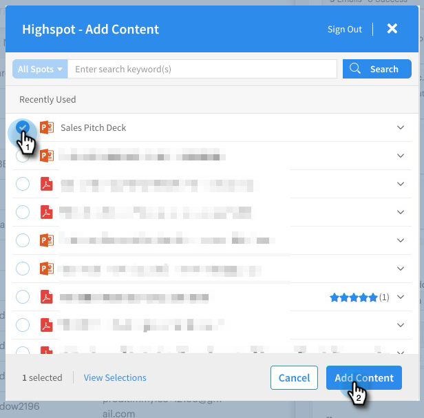

# Adicionar conteúdo de destaque ao seu email {#adding-highspot-content-to-your-email}

Se você for um cliente do Highspot, é possível inserir facilmente o conteúdo do Highspot nos emails de Vendas do Markto.

1. Criar seu rascunho de email (há várias maneiras de fazer isso, neste exemplo, estamos selecionando **Compor** no cabeçalho).

   

1. Preencha o campo Para e insira um Assunto.

   

1. Escreva sua mensagem. Clique no local do email em que deseja inserir o conteúdo do Realce. Clique no menu suspenso da seta (ao lado do ícone da imagem) e selecione **Ponto alto**.

   

1. Faça logon em sua conta do Highspot.

   

1. Selecione o conteúdo desejado e clique no botão **Adicionar conteúdo** botão.

   

   >[!TIP]
   >
   >Se você não vir rapidamente o conteúdo desejado, use a barra de pesquisa na parte superior.

   O conteúdo aparece como um link no seu email. O recipient pode clicar no link para exibi-lo/baixá-lo.

   
