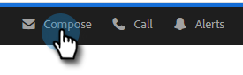

# Agendamento de um email {#scheduling-an-email}

Siga estas etapas fáceis para agendar um email.

>[!NOTE]
>
>Para atualizar o fuso horário padrão, vá para a página Configurações.

1. Crie seu rascunho de email (há várias maneiras de fazer isso, neste exemplo, estamos escolhendo **Compor** no cabeçalho).

   

1. Quando terminar de redigir o email, clique em **Agendar** na parte inferior direita

   

1. Clique na data para abrir o seletor de datas e selecione uma data.

   

1. Insira a hora em que deseja que o email seja enviado. Selecione o fuso horário desejado e clique em **Salvar**. Feche o programador quando terminar.

   

1. Agora que a data/hora agendada está selecionada, clique em **Enviar** para agendar o email.

   

   >[!NOTE]
   >
   >Os emails agendados podem ser exibidos/editados na seção de pastas agendadas do Centro de comando.

   >[!MORELIKETHIS]
   >
   >[Visão geral do Command Center](/help/marketo/product-docs/marketo-sales-insight/actions/email/command-center/command-center-overview.md)
