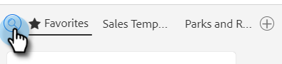

# Uso de um modelo na janela Compor {#using-a-template-in-the-compose-window}

## Localização e uso de modelos {#finding-and-using-templates}

1. Crie seu rascunho de email (há várias maneiras de fazer isso, neste exemplo, estamos escolhendo **[!UICONTROL Compor]** no cabeçalho).

   

1. Preencha o campo [!UICONTROL Para].

   

1. Clique no ícone de pesquisa na seção template para abrir o campo de pesquisa do template.

   

1. Selecione uma categoria para pesquisar (ou selecione [!UICONTROL Tudo] para pesquisar em todas as categorias).

   

1. Pesquise por nome do template, linha de assunto ou corpo do email. Clique no modelo desejado para selecioná-lo.

   

   >[!NOTE]
   >
   >Selecionar outro modelo substituirá todas as informações atualmente no editor. Se você fizer alterações, copie-as antes de selecionar outro modelo.

## Fixando Categorias de Modelo na Janela Compor {#pinning-template-categories-in-the-compose-window}

Marque **até cinco** categorias de modelo específicas para obter acesso rápido aos modelos mais usados.

1. Crie seu rascunho de email (há várias maneiras de fazer isso, neste exemplo, estamos escolhendo **[!UICONTROL Compor]** no cabeçalho).

   

1. Clique no ícone **+** ao lado de [!UICONTROL Favoritos].

   

1. Clique no menu suspenso **[!UICONTROL Fixar uma Categoria]** e selecione a categoria desejada.

   

   >[!TIP]
   >
   >Recomendamos fixar a categoria &quot;Todos&quot; para fornecer acesso rápido à pesquisa em toda a biblioteca de modelos, já que geralmente é necessário pesquisar em todos os modelos para encontrar o que está procurando. Quando você tiver uma categoria fixada selecionada e clicar no ícone de pesquisa, a pesquisa assumirá como padrão a pesquisa dentro da categoria fixada selecionada.

1. Clique em **Salvar alterações** quando terminar (opcional: repita a Etapa 3 para adicionar mais).

   

   >[!TIP]
   >
   >Você pode reorganizar suas categorias fixadas simplesmente arrastando e soltando antes de salvar as alterações.

   

   >[!NOTE]
   >
   >Por padrão, **[!UICONTROL Favoritos]** estão lá. Ele contém templates de email favoritos, não categorias.

   A categoria selecionada agora está fixada.
