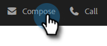

# Usando um modelo na janela Compor {#using-a-template-in-the-compose-window}

## Localização e uso de modelos {#finding-and-using-templates}

1. Criar seu rascunho de email (há várias maneiras de fazer isso, neste exemplo, estamos escolhendo **Compor** no cabeçalho).

   

1. Preencha o campo Até .

   

1. Clique no ícone de pesquisa na seção modelo para abrir o campo de pesquisa do modelo.

   

1. Selecione uma categoria para pesquisar (ou selecione Tudo para pesquisar em todas as categorias).

   

1. Pesquise por nome do modelo, linha de assunto ou corpo do email. Clique no modelo desejado para selecioná-lo.

   

   >[!NOTE]
   >
   >Selecionar outro modelo substituirá todas as informações no editor. Se você fizer alterações, certifique-se de copiá-las antes de selecionar outro modelo.

## Prender Categorias de Modelo na Janela Compor {#pinning-template-categories-in-the-compose-window}

Favorito **até cinco** categorias de modelo específicas para obter acesso rápido aos modelos mais usados.

1. Criar seu rascunho de email (há várias maneiras de fazer isso, neste exemplo, estamos escolhendo **Compor** no cabeçalho).

   

1. Clique no botão **+** ícone ao lado de Favoritos.

   

1. Clique no botão **Fixar uma categoria** e selecione a categoria desejada.

   

1. Clique em **Salvar alterações** quando concluído (opcional: repita a Etapa 3 para adicionar mais).

   

   >[!TIP]
   >
   >Você pode reorganizar as categorias fixadas simplesmente arrastando e soltando antes de salvar as alterações.

   

   >[!NOTE]
   >
   >**Favoritos** está lá por padrão. Ele contém modelos de email favoritos, não categorias.

   A categoria selecionada foi fixada.
