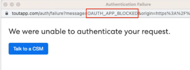

# Como Corrijo &quot;Não Conseguimos Autenticar Sua Solicitação&quot; Ao Conectar-Se A [!DNL Salesforce] {#how-do-i-fix-we-were-unable-to-authenticate-your-request-when-connecting-to-salesforce}

Se estiver tentando conectar sua instância do Marketo Sales ao Salesforce e estiver vendo o erro &quot;Não foi possível autenticar sua solicitação&quot;, provavelmente ele está relacionado à configuração da instância do Salesforce.

Há dois tipos de erros que podem estar produzindo esta página de autenticação com falha.

* Domínio restrito por erro de logon
* Aplicativo Oauth Bloqueado

Você pode identificar o tipo que está recebendo verificando o URL.

## Resolver domínio restrito com erro de logon {#resolve-login-error-restricted-domain}

Normalmente, esse erro indica que você tem um domínio personalizado para o qual não podemos rotear. Para resolver esse erro, tente fazer logon primeiro na instância do Salesforce à qual deseja se conectar. Em seguida, siga as etapas para se conectar ao Salesforce.

Se a instância à qual você está tentando se conectar for um domínio Salesforce Sandbox e você estiver recebendo um erro, será necessário executar etapas adicionais para atualizar sua instância para ser compatível com o Salesforce Sandbox. [Saiba mais](/help/marketo/product-docs/marketo-sales-insight/actions/crm/salesforce-integration/set-up-a-sales-insight-actions-sandbox.md){target="_blank"}.

## Resolver Aplicativo Oauth Bloqueado {#resolve-oauth-app-blocked}

Se você receber a mensagem de erro &quot;Não foi possível autenticar sua solicitação&quot; com o tipo de erro Bloqueado do aplicativo OAuth (ou outro tipo) no URL, pode haver uma restrição no acesso à API do Salesforce. Consulte o administrador do Salesforce para verificar se os itens abaixo estão em vigor.

### Habilitar API em Permissões do usuário {#enable-api-in-user-permissions}

1. Peça a um administrador do Salesforce que faça logon no Salesforce.
1. Selecione **Instalação**.
1. Selecione **Gerenciar Usuários**.
1. Selecione **Perfis**.
1. Localize o Perfil em que estão os usuários do ToutApp e clique em **Editar**.
1. Role para baixo até **Permissões administrativas** e verifique se **API Habilitada** está marcado.

### Verifique se o Salesforce está bloqueando a conexão das ações do Sales Insight {#check-if-salesforce-is-blocking-sales-insight-actions-from-connecting}

1. Peça a um administrador do Salesforce que faça logon no Salesforce.
1. Selecione **Instalação**.
1. Selecione **Gerenciar Aplicativos**.
1. Selecione **Uso do OAuth de aplicativos conectados**.
1. Certifique-se de que as Ações do Sales Insight exibem &quot;Bloquear&quot; ao lado dele. Se você vir &quot;Desbloquear&quot;, clique no botão para desbloquear o acesso das Ações do Sales Insight ao Salesforce.
