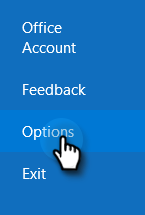
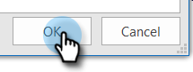
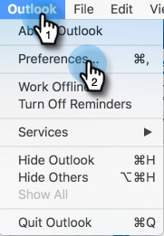

# Como impedir as autovisualizações? {#how-do-i-prevent-self-views}

Obter falsos positivos no rastreamento de visualização pode gerar inconsistências de relatório. Isso geralmente ocorre quando usuários do [!DNL Marketo Sales] invocam acidentalmente o pixel de rastreamento do cliente de email (chamamos isso de visualização automática). Abaixo estão algumas dicas sobre como reduzir significativamente e até mesmo eliminar as autovisualizações.

## Web ([!DNL Outlook] aplicativo da Web e Gmail) {#web-outlook-web-app-and-gmail}

O [!DNL Marketo Sales] armazenará um cookie em seu navegador para impedir que os modos de exibição sejam rastreados ao abrir seus emails do [!DNL Outlook] Web App e do Gmail. Se você ainda estiver recebendo visualizações pessoais, recomendamos fazer o seguinte:

* Verifique se os cookies estão ativados no computador.

* Se estiver usando um novo computador ou dispositivo móvel, verifique se você fez logon no aplicativo web. Isso nos permitirá reconhecer seu computador/dispositivo a partir de agora.

## Área de trabalho (Windows) {#desktop-windows}

As visualizações são rastreadas baixando um pequeno pixel de imagem invisível em seu cliente de email. Você pode reduzir significativamente a quantidade de visualizações automáticas em [!DNL Outlook] desabilitando imagens para download automático. Abaixo estão as etapas como.

1. No Outlook, clique em **[!UICONTROL Arquivo]** na barra de menus.

   

1. Clique em **[!UICONTROL Opções]**.

   

1. Na caixa de diálogo [!DNL Outlook] Opções, clique em **[!UICONTROL Central de Confiabilidade]**.

   

1. Em Central de Confiabilidade do Microsoft [!DNL Outlook], clique em **[!UICONTROL Configurações da Central de Confiabilidade]**.

   

1. Clique em [!UICONTROL Download Automático] no menu à esquerda e marque a caixa de seleção **[!UICONTROL Não baixar imagens automaticamente em emails do HTML ou itens RSS]**.

   

1. Clique em **[!UICONTROL OK]** na caixa de diálogo [!UICONTROL Central de Confiabilidade].

   

1. Clique em **[!UICONTROL OK]** na caixa de diálogo [!DNL Outlook] Opções.

   

## Desktop (Mac) {#desktop-mac}

As visualizações são rastreadas baixando um pequeno pixel de imagem invisível em seu cliente de email. Você pode reduzir significativamente a quantidade de visualizações automáticas em [!DNL Outlook] desabilitando imagens para download automático. Abaixo estão as etapas como.

1. Em [!DNL Outlook], clique em **[!UICONTROL Outlook]** na barra de menus e selecione **[!UICONTROL Preferências]**.

   

1. Em [!UICONTROL Email], escolha **[!UICONTROL Leitura]**.

   

1. Em [!UICONTROL Segurança], clique no botão de opção **[!UICONTROL Nunca]**.

   
