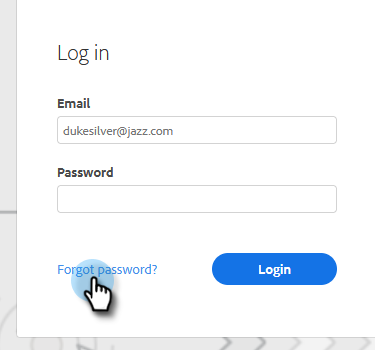
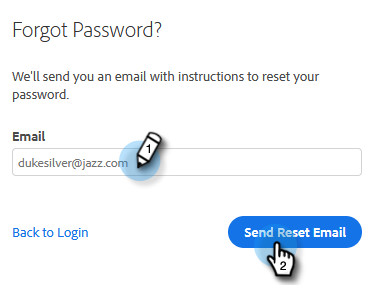

# Alterar a senha de vendas do Marketo {#change-your-marketo-sales-password}

Precisa alterar sua senha? Veja como.

## Alterar Sua Senha Ao Entrar {#change-your-password-while-signed-in}

1. Clique no ícone de engrenagem e selecione **Configurações**.

   

1. A página Meu perfil é aberta por padrão. Em Detalhes da conta, marque a caixa de seleção **Alterar senha**.

   

1. Digite sua senha atual. Em seguida, insira o novo e digite-o novamente, certificando-se de que ele corresponde. Clique em **Salvar** quando terminar.

   

>[!NOTE]
>
>As senhas devem:
>
>* Ter pelo menos nove caracteres
>* Usar mistura de maiúsculas e minúsculas (tanto MAIÚSCULAS quanto MINÚSCULAS)
>* Incluir um número
>* Incluir um caractere especial

## Alterar a senha ao sair {#change-your-password-while-signed-out}

1. Navegue até a página [Login do Sales Connect](https://toutapp.com/login). Digite seu endereço de email e clique em **Logon**.

   

1. Clique em **Esqueceu a senha**.

   

1. Digite o endereço de email associado à conta e clique em **Enviar email de redefinição**.

   

1. Enviaremos um email para verificar se o proprietário da conta deseja alterar a senha. Clique em **Redefinir senha**.

   

   >[!NOTE]
   >
   >Certifique-se de verificar sua pasta de spam também, pois esse e-mail pode, às vezes, acabar lá.

1. Digite e confirme sua nova senha. Clique em **Definir senha** quando terminar.

   
