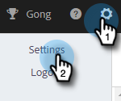
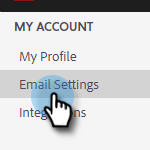

# Adicionar identidade {#add-identity}

Adicione uma identidade quando tiver vários endereços de email dos quais enviar.

>[!NOTE]
>
>O uso de várias identidades não é compatível com os canais de entrega do Gmail ou Outlook/Exchange. O Gmail e o Outlook/Exchange são autenticados no nível do usuário, de modo que somente os emails do endereço de email conectado serão enviados. Para usar várias identidades com endereços de email diferentes, será necessário conectar um provedor SMTP de terceiros (canal de delivery de email) que permita registrar domínios de email dos quais enviar. Isso permite que os usuários se conectem ao canal de delivery SMTP e enviem de qualquer endereço de email, desde que sejam um domínio registrado.

1. Clique no ícone Configurações.

   

1. Clique em **Configurações de email**.

   

1. Clique em **Adicionar identidade**.

   

1. Insira as informações (email e nome são campos obrigatórios) e clique em **Criar**.

   

1. Você receberá um email &quot;Verifique o endereço de email&quot;. Para verificar, clique em **Verificar Endereço de Email**.

   

Ao enviar um email no Marketo Sales e ter várias identidades, você pode alternar entre elas.

>[!NOTE]
>
>Não há limite para a quantidade de identidades de email que você pode configurar.

>[!MORELIKETHIS]
>
>[Adicionar ou atualizar sua assinatura de email](/help/marketo/product-docs/marketo-sales-insight/actions/getting-started/email-settings/add-or-update-your-email-signature.md).
