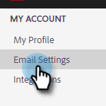

# Adicionar ou atualizar sua assinatura de email {#add-or-update-your-email-signature}

Queremos que o envio por email do setor de Vendas Marketo seja uma experiência perfeita ao ser enviado por seu próprio cliente de email. Uma ótima maneira de fazer isso é adicionar sua assinatura de email.

1. Clique no ícone de engrenagem e selecione **[!UICONTROL Configurações]**.

   

1. Em [!UICONTROL Minha conta], selecione **[!UICONTROL Configurações de email]**.

   

1. Na guia **[!UICONTROL Endereço e Assinatura]**, selecione a identidade de email para a qual deseja criar uma assinatura.

   

1. No cartão [!UICONTROL Assinatura], clique em **[!UICONTROL Editar]**.

   

1. Insira o texto (ou imagens) desejado(s) e clique em **[!UICONTROL Salvar]**.

   

   >[!TIP]
   >
   >Verifique se a assinatura na tela de composição é semelhante à assinatura listada no cliente de email.
