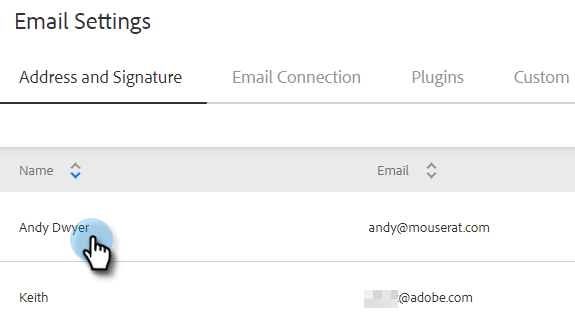

# Adicionar ou atualizar sua assinatura de email {#add-or-update-your-email-signature}

Queremos que o envio de emails do Marketo Sales sinta uma experiência contínua ao enviar por seu próprio cliente de email. Uma ótima maneira de fazer isso é adicionar sua assinatura de email.

1. Clique no ícone de engrenagem e selecione **Configurações**.

   

1. Em Minha conta, selecione **Configurações de email**.

   

1. No **Endereço e assinatura** selecione a identidade do email para a qual deseja criar uma assinatura.

   

1. No cartão de assinatura, clique em **Editar**.

   

1. Insira o texto desejado (ou imagens) e clique em **Salvar**.

   

   >[!TIP]
   >
   >Certifique-se de que sua assinatura na tela de composição seja semelhante à assinatura listada no seu cliente de email.
