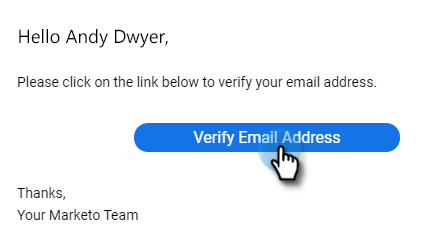

# Confirmar seu email {#verify-your-email}

Se você tiver uma identidade de email que não foi verificada, siga as etapas abaixo.

1. Clique no ícone de engrenagem na parte superior direita e escolha **[!UICONTROL Configurações]**.

   

1. Em [!UICONTROL Minha conta], clique em **[!UICONTROL Configurações de email]**.

   

1. Em [!UICONTROL Endereço e Assinatura], localize o email que deseja verificar e clique em **[!UICONTROL Reenviar Email de Verificação]**. Um novo email de verificação será enviado.

   

1. Clique em **[!UICONTROL Reenviar]**.

   

1. O recipient abre o email e segue as etapas para verificar o endereço de email.

   

>[!NOTE]
>
>Se você não receber o email de verificação, verifique sua pasta de spam. Se não estiver lá, contate o [Suporte da Marketo](https://nation.marketo.com/t5/Support/ct-p/Support).
