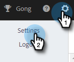

# Gerenciar seu perfil {#manage-your-profile}

Na página Meu perfil, você pode atualizar seu nome, o idioma/local/fuso horário de sua conta e alterar a senha.

## Detalhes da conta {#account-details}

Aqui você pode atualizar seu nome e/ou senha.

1. Clique no ícone de engrenagem e selecione **Configurações**.

   

1. A página Meu perfil é aberta por padrão. Para atualizar seu nome, basta digitar as alterações e clicar em **Salvar**.

   

>[!NOTE]
>
>Seu endereço de email está definido para exibição somente. Se você também precisar alterar isso, contate o [Suporte da Marketo](https://nation.marketo.com/t5/Support/ct-p/Support).

Você também pode alterar sua senha nesta seção. As etapas são descritas neste documento.

## Suas integrações {#your-integrations}

No lado direito da página, a seção Suas integrações fornece o status de todas as conexões da conta.

>[!NOTE]
>
>Se você estiver usando o Exchange no local com o Marketo Sales, isso não atualizará as verificações de integridade da integração do Canal de entrega (primeiro item da linha) ou do Rastreamento de resposta (segundo item da linha). Estamos trabalhando para oferecer suporte a isso em uma versão futura.

## Fuso horário {#time-zone}

Veja como alterar o idioma, a localidade e/ou o fuso horário de sua conta.

>[!NOTE]
>
>Idiomas suportados: inglês, francês, alemão, japonês, português, espanhol.

1. Clique no ícone de engrenagem e selecione **Configurações**.

   

1. Para alterar o idioma, clique no menu suspenso **Idioma** e faça sua escolha.

   

1. Localidade aqui refere-se à região em que o idioma é falado. Um será escolhido por padrão quando você alterar o idioma, mas para alterá-lo manualmente, clique no menu suspenso **Local** e faça sua escolha.

   

1. Clique na lista suspensa **Seu fuso horário** e faça sua escolha.

   

1. Clique em **Salvar** quando terminar.

   

Et voilà!
