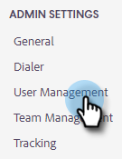

# Guia do administrador de ações do MSI {#msi-actions-admin-guide}

>[!PREREQUISITES]
>
>* Confirme com seu Gerente de sucesso do cliente se as ações MSI foram habilitadas para sua conta do Marketo (se você não tiver um CSM, [entre em contato com o Suporte da Marketo](https://nation.marketo.com/t5/support/ct-p/Support)).
>* A sincronização Marketo/Salesforce deve ser configurada.

<table>
 <tr>
  <th>Persona</th>
  <th>Etapa</th>
 </tr>
 <tr>
  <td>Administrador do Marketo</td>
  <td>Configurar conta de Vendas do Marketo</td>
 </tr>
 <tr>
  <td>Administrador do Marketo ou  Administrador do Salesforce</td>
  <td>Conexão da conta de vendas da Marketo ao Salesforce</td>
 </tr>
 <tr>
  <td>Administrador do Marketo</td>
  <td>Conexão da conta do Marketo Sales à Marketo</td>
 </tr>
 <tr>
  <td>Administrador do Marketo</td>
  <td>Iniciar Sincronização de Dados do Marketo para a Conta de Vendas da Marketo</td>
 </tr>
 <tr>
  <td>Administrador do Marketo</td>
  <td>Convidar usuários para ações MSI</td>
 </tr>
 <tr>
  <td>Administrador do Salesforce</td>
  <td>Instalar/atualizar o pacote MSI no Salesforce</td>
 </tr>
 <tr>
  <td>Administrador do Salesforce</td>
  <td>Configurar ações MSI no Salesforce</td>
 </tr>
</table>

## Configurar conta de vendas do Marketo {#set-up-marketo-sales-account}

1. No Marketo, clique em **Administrador**.

   

1. Clique em **Insight de vendas**, em seguida **Configuração de ações**. Selecione de uma lista de administradores do Marketo para convidar e clique em **Enviar convite**.

   

O usuário receberá um email com etapas para obter acesso à conta.

>[!NOTE]
>
>Usuários adicionais não serão adicionados por meio do Marketo e serão adicionados por meio da página Gerenciamento de usuários da conta de vendas . [Clique aqui](/help/marketo/product-docs/marketo-sales-connect/admin/invite-users.md) para saber mais sobre como adicionar usuários adicionais.

## Conexão da conta de vendas da Marketo ao Salesforce {#connect-marketo-sales-account-to-salesforce}

1. Na conta de Vendas Marketo, clique no ícone de engrenagem e selecione **Configurações**.

   

1. Em Configurações de administração, clique em **Salesforce**.

   

1. Na guia Conexões e personalizações , clique em **Connect**.

   

1. Clique em **OK**.

   

Se já estiver conectado ao Salesforce, você estará conectado. Caso contrário, você será solicitado a fazer logon.

## Conecte o Marketo à sua conta de aplicativos de vendas {#connect-marketo-to-your-sales-apps-account}

1. Na conta de Vendas Marketo, clique no ícone de engrenagem e selecione **Configurações**.

   

1. Em Configurações de administração, clique em **Marketo**.

   

1. Clique em **connect**. Sua conta será conectada.

   

>[!NOTE]
>
>Se ele não se conectar, copie as credenciais da guia &quot;Configuração de ações&quot; do Marketo Sales Insight e cole-as na guia Configurar .

## Iniciar Sincronização de Dados {#initiate-data-sync}

A sincronização de campo de unificação de dados para Ações de Insight de vendas permite que o sistema extraia informações de pessoas do banco de dados do Marketo Engage para o banco de dados de Ações de insight de vendas, mantendo os dados de pessoas atualizados e garantindo que as atividades sejam registradas nos registros corretos no Marketo e no Salesforce.

1. No Marketo, clique em **Administrador**.

   

1. Clique em **Insight de vendas**.

   

1. Clique no botão **Configuração de ações** guia . No cartão Sincronização do campo de ação, clique em **Sincronizar**.

   

1. Você verá uma pré-visualização dos campos que serão sincronizados. Clique em **Iniciar Sincronização**.

   

Os registros de pessoa que existem no Marketo e no Salesforce serão sincronizados com sua conta de Aplicativos de vendas da Marketo.

>[!NOTE]
>
>Para saber mais sobre como as pessoas e os dados de atividades são sincronizados entre as Ações de insight de vendas, o Marketo e o Salesforce, [clique aqui](/help/marketo/product-docs/marketo-sales-insight/actions/admin/actions-data-sync-faq.md).

## Convidar usuários individuais para ações MSI {#invite-individual-users-to-msi-actions}

1. Na conta de Vendas Marketo, clique no ícone de engrenagem e selecione **Configurações**.

   

1. Em Configurações de administração, selecione **Gerenciamento de usuários**.

   

1. Clique em **Ações** e selecione **Convidar usuários**.

   

1. Insira os endereços de email e clique em **Convidar**.

   

>[!NOTE]
>
>Por padrão, todos os novos membros serão adicionados à equipe Todos.

Você receberá uma mensagem de confirmação.

## Convidar usuários via CSV para ações MSI {#invite-users-via-csv-to-msi-actions}

1. Na conta de Vendas Marketo, clique no ícone de engrenagem e selecione **Configurações**.

   

1. Em Configurações de administração, selecione **Gerenciamento de usuários**.

   

1. Clique em **Ações** e selecione **Convidar usuários via CSV**.

   

1. Procure o CSV em seu computador, selecione-o e clique em **Próximo**.

   

1. Confirme se os campos estão mapeados corretamente e clique em **Convidar**.

   

Você receberá uma mensagem de confirmação quando os convites forem enviados.

>[!NOTE]
>
>Feito isso, você pode atualizar seu pacote MSI existente ou instalar um novo e passar para [configuração de ações MSI no Salesforce](/help/marketo/product-docs/marketo-sales-insight/actions/salesforce-configuration/msi-actions-configuration-in-salesforce.md).
