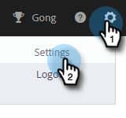
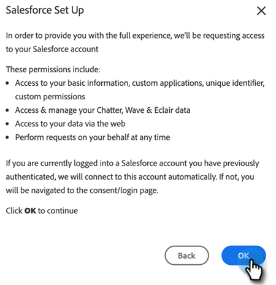

# Guia de configuração do administrador de ações do Sales Insight {#sales-insight-actions-admin-setup-guide}

>[!NOTE]
>
>O Marketo Sales Insight Actions é um aplicativo baseado na Web que se integra exclusivamente ao Salesforce CRM por meio do [pacote Marketo Sales Insight](/help/marketo/product-docs/marketo-sales-insight/msi-for-salesforce/installation/install-marketo-sales-insight-package-in-salesforce-appexchange.md){target="_blank"}. Às vezes, é chamado de &quot;Vendas do Marketo&quot; ou simplesmente &quot;Ações&quot;.

>[!PREREQUISITES]
>
>* Confirme com a Equipe de Conta da Adobe (seu Gerente de Conta) que as Ações MSI foram habilitadas para sua Conta da Marketo Engage (se você não tiver um Gerente de Conta, contate o [Suporte da Marketo](https://nation.marketo.com/t5/support/ct-p/Support){target="_blank"}).
>* A sincronização do Marketo/Salesforce deve estar configurada.

<table>
 <tr>
  <th>Perfil</th>
  <th>Etapa</th>
 </tr>
 <tr>
  <td>Administrador do Marketo</td>
  <td>Configurar a conta de vendas do Marketo</td>
 </tr>
 <tr>
  <td>Administrador do Marketo ou Administrador  [!DNL Salesforce]</td>
  <td>Conectar a conta de vendas do Marketo a [!DNL Salesforce]</td>
 </tr>
 <tr>
  <td>Administrador do Marketo</td>
  <td>Conectar a conta de vendas do Marketo à Marketo</td>
 </tr>
 <tr>
  <td>Administrador do Marketo</td>
  <td>Iniciar Sincronização de Dados do Marketo para a Conta de Vendas do Marketo</td>
 </tr>
 <tr>
  <td>Administrador do Marketo</td>
  <td>Convidar usuários para ações MSI</td>
 </tr>
 <tr>
  <td>[!DNL Salesforce] Administrador</td>
  <td>Instalar/atualizar pacote MSI no [!DNL Salesforce]</td>
 </tr>
 <tr>
  <td>[!DNL Salesforce] Administrador</td>
  <td>Configurar ações do MSI no [!DNL Salesforce]</td>
 </tr>
</table>

## Configurar Conta de Vendas do Marketo {#set-up-marketo-sales-account}

1. No Marketo, clique em **[!UICONTROL Admin]**.

   

   >[!NOTE]
   >
   >Se você não estiver vendo uma ID do cliente e um Segredo do cliente no cartão de Informações de integração, ative a instância das Ações convidando o primeiro usuário e verá a ID do cliente e o Segredo do cliente aparecerem.

1. Clique em **Sales Insight** e depois em **Actions Config**. Selecione de uma lista de administradores do Marketo a convidar e clique em **Enviar Convite**.

   

O usuário receberá um email com etapas para obter acesso à conta.

>[!NOTE]
>
>Outros usuários não serão adicionados por meio do Marketo e serão adicionados por meio da página Gerenciamento de usuários da conta de vendas. [Clique aqui](/help/marketo/product-docs/marketo-sales-connect/admin/invite-users.md){target="_blank"} para saber mais sobre como adicionar outros usuários.

## Conectar a Conta de Vendas da Marketo a [!DNL Salesforce] {#connect-marketo-sales-account-to-salesforce}

1. Na sua conta do Marketo Sales, clique no ícone de engrenagem e selecione **[!UICONTROL Configurações]**.

   

1. Em [!UICONTROL Configurações de Administração], clique em **[!UICONTROL Salesforce]**.

   

1. Na guia [!UICONTROL Conexões e personalizações], clique em **[!UICONTROL Conectar]**.

   

1. Clique em **[!UICONTROL OK]**.

   

Se você já estiver conectado ao Salesforce, estará conectado. Caso não esteja, você será solicitado a fazer logon.

## Conectar o Marketo à sua conta de aplicativos de vendas {#connect-marketo-to-your-sales-apps-account}

1. Na sua conta do Marketo Sales, clique no ícone de engrenagem e selecione **[!UICONTROL Configurações]**.

   

1. Em [!UICONTROL Configurações de Administração], clique em **Marketo**.

   

1. Clique em **[!UICONTROL conectar]**. Sua conta será conectada.

   

>[!NOTE]
>
>Se ele não se conectar, copie as credenciais da guia &quot;Configuração de ações&quot; do Marketo Sales Insight e cole-as na guia Configuração.

## Iniciar Sincronização de Dados {#initiate-data-sync}

A sincronização de campo de unificação de dados para Ações do Sales Insight permite que o sistema extraia informações de pessoas do banco de dados do Marketo Engage para o banco de dados de Ações do Sales Insight, mantendo os dados de pessoas atualizados e garantindo que as atividades sejam registradas nos registros corretos no Marketo e no [!DNL Salesforce].

>[!CAUTION]
>
>Depois de iniciar a sincronização de dados, você deve **não** remover o usuário original na instância das Ações do Sales Insight. Este é o usuário para o qual o primeiro convite foi enviado.

1. No Marketo, clique em **[!UICONTROL Admin]**.

   

1. Clique em **[!UICONTROL Sales Insight]**.

   

1. Clique na guia **[!UICONTROL Configurações de ações]**. No cartão Sincronização de Campo de Ação, clique em **[!UICONTROL Sincronizar]**.

   

1. Você verá uma pré-visualização dos campos que serão sincronizados. Clique em **[!UICONTROL Iniciar sincronização]**.

   

Os registros de pessoa que existem no Marketo e no [!DNL Salesforce] serão sincronizados com sua conta do Marketo Sales Apps.

>[!NOTE]
>
>Para saber mais sobre como as pessoas e os dados de atividade são sincronizados entre as Ações de Insight de Vendas, Marketo e Salesforce, [clique aqui](/help/marketo/product-docs/marketo-sales-insight/actions/admin/sync-sales-action-data-with-marketo-and-salesforce.md){target="_blank"}.

## Convidar usuários individuais para ações do MSI {#invite-individual-users-to-msi-actions}

1. Na sua conta do Marketo Sales, clique no ícone de engrenagem e selecione **[!UICONTROL Configurações]**.

   

1. Em [!UICONTROL Configurações de Administração], selecione **[!UICONTROL Gerenciamento de Usuários]**.

   

1. Clique em **[!UICONTROL Ações]** e selecione **[!UICONTROL Convidar Usuários]**.

   

1. Insira o(s) endereço(s) de email e clique em **[!UICONTROL Convidar]**.

   

>[!NOTE]
>
>Por padrão, todos os novos membros serão adicionados à equipe Todos.

Você receberá uma mensagem de confirmação.

## Convidar usuários via CSV para ações MSI {#invite-users-via-csv-to-msi-actions}

1. Na sua conta do Marketo Sales, clique no ícone de engrenagem e selecione **[!UICONTROL Configurações]**.

   

1. Em [!UICONTROL Configurações de Administração], selecione **[!UICONTROL Gerenciamento de Usuários]**.

   

1. Clique em **[!UICONTROL Ações]** e selecione **[!UICONTROL Convidar usuários via CSV]**.

   

1. Procure o CSV no computador, selecione-o e clique em **[!UICONTROL Avançar]**.

   

1. Confirme se os campos estão mapeados corretamente e clique em **[!UICONTROL Convidar]**.

   

Você receberá uma mensagem de confirmação assim que os convites forem enviados.

>[!NOTE]
>
>Depois disso, você poderá atualizar seu pacote MSI existente ou instalar um novo e seguir para [configuração de Ações MSI no Salesforce](/help/marketo/product-docs/marketo-sales-insight/actions/crm/salesforce-package-configuration/sales-insight-actions-configuration-in-salesforce.md){target="_blank"}.
