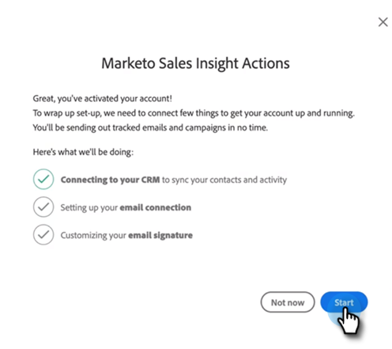

# Guia de integração do usuário de ações do Sales Insight {#sales-insight-actions-user-onboarding-guide}

>[!NOTE]
>
>As Ações do Marketo Sales Insight são um aplicativo baseado na Web que se integra à interface do usuário do Salesforce por meio do [pacote do Marketo Sales Insight](/help/marketo/product-docs/marketo-sales-insight/msi-for-salesforce/installation/install-marketo-sales-insight-package-in-salesforce-appexchange.md){target="_blank"}. Às vezes, é chamado de &quot;Vendas do Marketo&quot; ou simplesmente &quot;Ações&quot;.

>[!PREREQUISITES]
>
>* Um administrador precisa convidar um usuário para começar a usar as ações MSI.
>* Para ativar sua conta no Salesforce, você precisará ter a &quot;API ativada&quot; nas permissões de perfil do Salesforce.

Os novos usuários precisarão seguir as etapas abaixo.

1. No email de boas-vindas, clique em **Introdução**.

   

1. Clique em **Ativar conta com Salesforce**.

   

1. Se você já estiver conectado à sua conta do Salesforce, será direcionado automaticamente para a próxima tela. Se você não estiver conectado, faça isso agora.

   

>[!NOTE]
>
>Sua ID de email do Salesforce e a ID de email da conta de vendas devem ser as mesmas.

1. Clique em **Permitir**.

   

1. Clique em **Iniciar**.

   

1. Clique em **Avançar**.

   

1. Escolha o cliente de email que você usa (Gmail ou Outlook) e clique em **Avançar**.

   

1. Digite seu endereço de email e clique em **Avançar**.

   

1. Digite sua senha e clique em **Avançar**.

   

1. Clique em **Continuar**.

   

>[!NOTE]
>
>Se você escolher o Outlook, verá uma tela de Autenticação do Outlook onde você inserirá seu endereço de email.

1. Você verá a mensagem de sucesso Configurar conexão de email e será enviado para a próxima tela.

   

1. Insira sua assinatura personalizada e clique em **Salvar** (se quiser fazer isso mais tarde por meio da página de perfil, clique em **Ignorar**).

   

1. Clique em **Concluir**.

   

1. Você verá a opção de exibir uma introdução rápida às Ações de Vendas do Marketo. Clique em **Avançar** para exibir ou **Não Agora** para salvar para mais tarde.

   

1. Quando terminar o tour, ou se o tiver ignorado, escolha se deseja fazer logon diretamente no aplicativo Web ou na sua conta do Salesforce, onde você pode acessar todos os recursos do painel MSI (neste exemplo, estamos escolhendo **Iniciar o Salesforce**).

   

1. Dentro do Salesforce (Classic ou Lightning), você pode navegar para qualquer cliente em potencial, contato, conta ou oportunidade. Todas as suas ações de vendas estarão disponíveis no menu suspenso do painel MSI.

   
