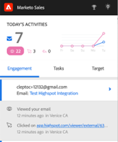

# Integração com o Highspot {#highspot-integration}

A equipe de vendas pode acessar os recursos de pontos altos em Ações de vendas da Insight e obter maior visibilidade, eficiência e desempenho durante todo o ciclo de vendas. Os usuários do Sales Insight Action podem selecionar o conteúdo de vendas armazenado na plataforma de capacitação de vendas do Highspot e inseri-lo diretamente em emails, modelos de email e campanhas de vendas, tudo isso enquanto capturam o rastreamento e a análise de conteúdo nas ações do Highspot e do Sales Insight.

## Habilitando a integração de pontos de acesso {#enabling-highspot-integration}

>[!NOTE]
>
>Você deve ter privilégios de Administrador para ativar o Highspot para sua instância de Ações do Sales Insight.

1. Clique no ícone de engrenagem e selecione **Configurações**.

   

1. Em **Configurações do Administrador**, selecione **Geral**.

   

1. Role até o cartão **Integrações** e clique no controle deslizante para habilitar o Highspot.

   

Agora os usuários verão uma opção para selecionar Realce ao selecionar o botão de upload de conteúdo na janela de composição, no editor de modelo e no editor de email da campanha.

## Acesso a conteúdo de pontos de acesso e compartilhamento via e-mail {#accessing-highspot-content}

Acesse o Highspot e adicione conteúdo aos seus emails da janela de composição Ações do Sales Insight, do editor de modelo e do editor de email da campanha de vendas. Abaixo estão as etapas sobre como acessar conteúdo da janela de composição.

1. Crie seu rascunho de email (há várias maneiras de fazer isso; neste exemplo, estamos selecionando **Compor** no cabeçalho).

   

1. Preencha o campo Para e informe um Assunto.

   

1. Escreva sua mensagem. Clique no local do email em que deseja inserir o conteúdo do ponto mais alto. Clique na lista suspensa de setas (ao lado do ícone de imagem) e selecione **Ponto alto**.

   

1. Faça login na sua conta do Highspot (se você ainda não estiver logado).

   

1. Selecione o conteúdo desejado e clique no botão **Adicionar conteúdo**.

   

   >[!TIP]
   >
   >Se você não visualizar rapidamente o conteúdo desejado, use a barra de pesquisa na parte superior.

   O conteúdo aparece como um link em seu email. O recipient pode clicar no link para exibi-lo/baixá-lo.

   

## Rastreamento de cliques no conteúdo de ponto de acesso {#tracking-clicks-on-highspot-content}

Quando os recipients abrirem o conteúdo enviado, você será notificado no feed ativo. A atividade será exibida como um clique, com detalhes sobre o link de conteúdo. Além disso, as visualizações de conteúdo e downloads serão rastreadas no Highspot.

