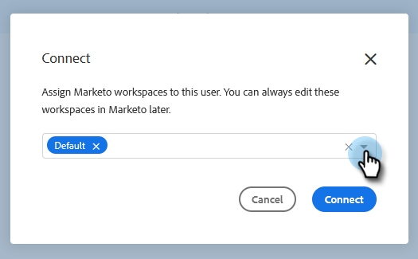

# Conceder acesso ao Marketo aos usuários {#grant-marketo-access-to-users}

Siga as etapas deste artigo para conceder aos usuários do [!DNL Sales Insight Actions] acesso à conexão do Marketo. Isso desbloqueará recursos como Momentos interessantes no Feed ao vivo e acesso a Campanhas de marketing.

Você precisará convidar usuários para [[!DNL Sales Insight Actions]](/help/marketo/product-docs/marketo-sales-insight/actions/admin/invite-users-and-admins.md#invite-users) antes que eles fiquem visíveis na página Marketo > [!UICONTROL Acesso à Equipe] (em [!DNL Sales Insight Actions]), onde o acesso à conexão do Marketo é concedido.

>[!CAUTION]
>
>Aguarde dez minutos após a conexão do [!DNL Sales Insight Actions] com o Marketo antes de executar essas etapas.

1. Clique no ícone de engrenagem e selecione **[!UICONTROL Configurações]**.

   

1. Em [!UICONTROL Configurações de Administração], clique em **Marketo**.

   

1. Clique na guia **[!UICONTROL Acesso de Usuário]**. Selecione um ou mais usuários e clique em **[!UICONTROL Conectar]**.

   

   >[!NOTE]
   >
   >Você só pode fazer a atribuição do espaço de trabalho uma vez no momento da concessão de acesso aos usuários. Depois de definido, é necessário desconectar o usuário para alterá-lo.

1. Se a assinatura do Marketo tiver espaços de trabalho habilitados, você poderá atribuir espaços de trabalho a cada usuário ou conjunto de usuários em massa. Se nenhum espaço de trabalho for selecionado, nós os atribuiremos ao espaço de trabalho Padrão do Marketo.

   

   **ETAPA OPCIONAL**: clique no menu suspenso Workspace e selecione o(s) espaço(s) de trabalho desejado(s).

   

1. Clique em **[!UICONTROL Conectar]**.

   

Você pode adicionar outros usuários da página [!UICONTROL Gerenciamento de Equipe] e seguir as etapas acima para conectá-los.
