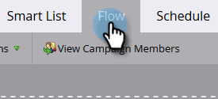

# Tornar uma campanha de marketing visível nas ações de insights de vendas {#make-a-marketing-campaign-visible-in-sales-insight-actions}

As campanhas só podem ser compartilhadas se estiverem visíveis.

Com as Ações de insights de vendas, os usuários terão acesso a um novo aplicativo de vendas chamado toutapp.com. Este aplicativo oferece a eles um novo conjunto de recursos de ação, mas também herda o recurso _Adicionar à Campanha de Marketing_, disponível na versão principal do Sales Insights. Isso é importante ter em mente, pois dependendo de onde você deseja que os usuários acessem o recurso Adicionar à campanha de marketing (toutapp.com ou a experiência do pacote MSI SFDC ), suas campanhas do Marketo precisarão ser configuradas de forma diferente. Consulte a nota na Etapa 4 para saber mais.

1. Selecione (ou crie) a Campanha que deseja compartilhar.

   

1. Clique na guia **Smart List**.

   

1. Adicione o acionador _Campanha solicitada_.

   

1. Para origem, escolha &quot;is&quot; **API de Serviço da Web**.

   

   >[!NOTE]
   >
   >Se você quiser mostrar a campanha de marketing para usuários que estão utilizando _Adicionar à Campanha de Marketing_ a partir do aplicativo Web toutapp.com (isso também inclui se você tiver o aplicativo Web incorporado ao CRM por meio do objeto Caixa de Saída de Vendas do Marketo), defina-o como &quot;API de Serviço da Web&quot;. Se desejar que a campanha de marketing seja exibida quando um usuário usar as ações no painel MSI no Salesforce nos botões de lead, contato, página da conta ou ação em massa nas exibições de lead e lista de contatos, atualize-a para &quot;Sales Insight&quot;

1. Clique na guia **Fluxo**.

   

1. Adicione a ação de fluxo _Momento interessante_.

   

1. Para Tipo, selecione **Web**.

   

1. Na caixa _Descrição_, escreva uma mensagem para a equipe de vendas. Neste exemplo, estamos usando tokens para especificar o formulário que foi preenchido.

   

1. Clique na guia **Agendar** e **Ativar** a campanha.

   
