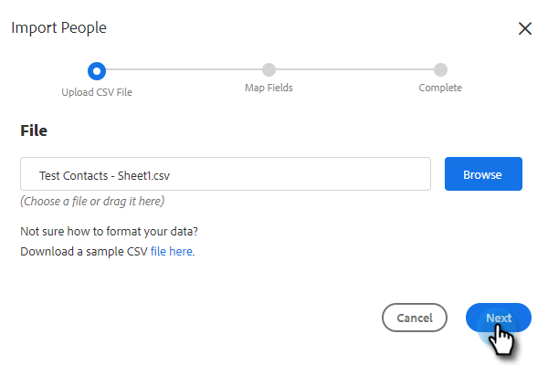

# Importar contatos via CSV {#import-contacts-via-csv}

Ter contatos na página Pessoas é importante porque é de onde extraímos para preencher automaticamente informações personalizadas nos campos dinâmicos em seus modelos. Certifique-se de que você tenha pelo menos um nome e um endereço de email para cada contato em seu CSV e que você mapeie para esses campos.

1. Selecione seu grupo (ou crie um novo) na guia People.

   

1. Clique em **Ações de Grupo** e selecione **Importar CSV**.

   

1. Clique em **Procurar**.

   

1. Localize o arquivo desejado no computador e selecione-o.

   >[!NOTE]
   >
   >Os grupos são limitados a 1000 contatos.

1. Clique em **Avançar**.

   

1. Mapeie as colunas em seu CSV para seus respectivos campos no Sales Connect. Clique em **Avançar** quando terminar.

   
