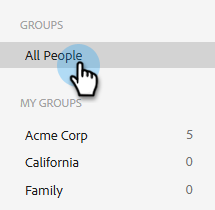

# Gerenciar grupos {#manage-groups}

Saiba como gerenciar grupos no [!DNL Sales Insight Actions].

## Tipos de grupo {#group-types}

<table>
 <colgroup>
  <col>
  <col>
 </colgroup>
 <tbody>
  <tr>
   <th>Grupo</th>
   <th>Descrição</th>
  </tr>
  <tr>
   <td>[!UICONTROL Todas as Pessoas]</td>
   <td>Todos os contatos de todos os usuários visíveis para você.</td>
  </tr>
  <tr>
   <td>[!UICONTROL Grupos Dinâmicos]</td>
   <td>Meus Contatos: todos os seus contatos. Cancelamentos de assinatura: contatos que optaram por não receber correspondência.</td>
  </tr>
  <tr>
   <td>[!UICONTROL Meus Grupos]</td>
   <td>Grupos criados. Eles podem conter seus contatos ou que foram compartilhados com você.</td>
  </tr>
  <tr>
   <td>[!UICONTROL Grupos de Equipes]</td>
   <td>Grupos que foram compartilhados com e/ou por você. Eles podem conter os contatos dos seus colegas de equipe ou os contatos que você compartilhou com eles.</td>
  </tr>
 </tbody>
</table>

## Criar um grupo {#create-a-group}

1. Na página [!UICONTROL Pessoas], clique em **+** ao lado de [!UICONTROL Grupos].

   

1. Nomeie seu grupo e clique em **[!UICONTROL Criar]**.

   

   Pronto!

## Adicionar contatos a um grupo {#add-contacts-to-a-group}

1. Em _Grupos_, selecione **Todas as Pessoas**.

   

1. Procure a pessoa ou pessoas que deseja adicionar.

   

1. Clique na caixa de seleção ao lado do nome para selecioná-los.

   

1. Clique no ícone de mais ações () e selecione **Adicionar Pessoas ao Grupo**.

   

1. Selecione o grupo ao qual você deseja adicioná-los e clique em **Adicionar**.

   

## Compartilhar um grupo {#share-a-group}

1. Na página [!UICONTROL Pessoas], localize e selecione o grupo que deseja compartilhar.

   

1. Clique nos dados (três pontos verticais) e selecione **[!UICONTROL Compartilhar]**.

   

1. Clique na lista suspensa, escolha a equipe com a qual deseja compartilhar o grupo e clique em **[!UICONTROL Compartilhar]**.

   

   Você ainda é o proprietário do grupo, mas ele agora aparecerá em _Grupos de Equipe_.

## Deixar de compartilhar um grupo {#unshare-a-group}

1. Na página [!UICONTROL Pessoas], localize e selecione o grupo que deseja cancelar o compartilhamento.

   

1. Clique nos dados (três pontos verticais) e selecione **[!UICONTROL Compartilhar]**.

   

1. Clique no **X** ao lado da equipe com a qual você compartilhou o grupo e clique fora do modal.

   

   O grupo agora não está compartilhado.

## Renomear um grupo {#rename-a-group}

1. Na página [!UICONTROL Pessoas], localize e selecione o grupo que deseja renomear.

   

1. Clique nos dados (três pontos verticais) e selecione **[!UICONTROL Editar]**.

   

1. Digite o novo nome e clique em **[!UICONTROL Salvar]**.

   

## Excluir um grupo {#delete-a-group}

1. Na página Pessoas, localize e selecione o grupo que deseja excluir.

   

1. Clique nos dados (três pontos verticais) e selecione **[!UICONTROL Excluir]**.

   

1. Clique em **[!UICONTROL Excluir]** para confirmar.

   
