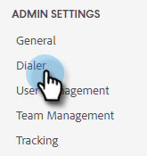

# Resultados da chamada {#call-outcomes}

Permitir que suas equipes de vendas selecionem resultados de chamadas ao fazer chamadas para que sua equipe possa entender o impacto dos esforços de engajamento do cliente.

>[!NOTE]
>
>**Permissões de administrador necessárias**

## Ativar Resultados de Chamadas {#enable-call-outcomes}

1. Clique no ícone de engrenagem e selecione **Configurações**.

   

1. Em Configurações de administração , selecione **Discador**.

   

1. Selecionar **Ativar Resultados de Chamadas**.

   

1. Escolha seu requisito de resultado de chamada desejado.

   

## Criar resultados de chamada {#create-call-outcomes}

>[!NOTE]
>
>Você pode criar no máximo 15 Resultados da chamada.

1. Clique no ícone de engrenagem e selecione **Configurações**.

   

1. Em Configurações de administração , selecione **Discador**.

   

1. Clique em **Gerenciar resultados de chamada**.

   

1. Insira o nome do resultado da chamada desejado no campo de texto.

   

1. Clique na lista suspensa Answered e escolha o tipo de resultado (neste exemplo, escolhemos Answered). Em seguida, clique em **Adicionar**.

   

## Escolha um resultado da chamada {#choose-a-call-outcome}

Após habilitar os resultados da chamada. Os usuários podem selecionar uma enquanto fazem uma chamada.

1. Clique no botão de chamada para iniciar o discador.

   

1. Insira as informações da chamada no discador e clique em **Chame**.

   

1. Selecione o resultado da chamada que melhor descreve a chamada.

   

1. Encerre a chamada .

   

1. Registre a chamada .

   

>[!MORELIKETHIS]
>
>* [Motivos de chamada de registro e resultados de chamada para o Salesforce](/help/marketo/product-docs/marketo-sales-insight/actions/phone/log-call-reasons-and-call-outcomes-to-salesforce.md)
>* [Motivos da chamada](/help/marketo/product-docs/marketo-sales-insight/actions/phone/call-reasons.md)

