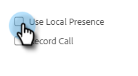

# Presença local {#local-presence}

A Presença local oferece a opção de fazer com que pareça que você está chamando do mesmo código de área do recipient.

## Selecionar Presença Local {#select-local-presence}

1. Clique no ícone do telefone para abrir o Sales Dialer.

   

1. Marque a caixa de seleção **[!UICONTROL Usar Presença Local]**.

   

## Perguntas frequentes {#faq}

**Meu contato pode me ligar novamente para este novo número?**

Não, a presença local só funciona para chamadas de saída. O chamador não pode ligar de volta para este &quot;novo&quot; número.

**Posso ligar para qualquer lugar com Presença Local?**

Oferecemos todas as funcionalidades de telefone de vendas para chamadas somente nos Estados Unidos.

**O número de presença local é sempre o mesmo quando eu chamo um código de área?**

O número provavelmente sempre será o mesmo ao chamar um código de área.

**O meu número inteiro muda ou apenas o código de área ao usar a presença local?**

Seu número inteiro será alterado.
