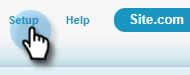
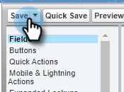

# Registrar motivos e resultados da chamada no Salesforce {#log-call-reasons-and-call-outcomes-to-salesforce}

Se você quiser registrar os resultados da chamada e os motivos da chamada para a Salesforce para fins de relatório ou visibilidade, é possível criar um campo de atividade personalizado para cada um. Cada campo deve usar um Nome de API específico (conhecido como &quot;Nome do campo&quot; no Salesforce).

* Nome do campo Resultados da chamada: mktosales_call_result
* Nome do Campo Motivos da Chamada: mktosales_call_reason

Para utilizar esses campos, primeiro será necessário criar o campo como um campo de atividade personalizado. Para torná-la visível aos usuários, será necessário adicioná-la ao layout da página do objeto da tarefa.

## Salesforce Classic {#salesforce-classic}

### Criar campo de atividade personalizado no Salesforce Classic  {#create-custom-activity-field-in-salesforce-classic}

1. No Salesforce, clique em **Instalação**.

   

1. Digite &quot;Atividades&quot; na caixa Localização rápida.

   

1. Clique em **Campos Personalizados de Atividade**.

   

1. Clique em **Novo**.

   

1. Selecione o tipo de dados &quot;Texto&quot; e clique em **Próximo**.

   

1. Dê ao campo personalizado o nome do campo conforme definido acima. O comprimento do campo tem um limite de 255 caracteres. Rótulo de campo será o campo visível para sua equipe de vendas e pode ser personalizado para atender às necessidades de sua equipe.

   

1. O restante das configurações é opcional. Após concluir a configuração, clique em **Avançar**.

   

1. Selecione as configurações de segurança em nível de campo desejadas para este campo e clique em **Avançar** (a imagem abaixo é apenas um exemplo).

   

   >[!NOTE]
   >
   >Verifique se o campo personalizado está visível para o perfil que os usuários das Ações do Sales Insight usam, juntamente com qualquer outro lugar em que você deseje que ele fique visível.

1. Selecione os layouts de página aos quais você deseja adicionar o campo e clique em **Salvar** (opcionalmente, você pode clicar em **Salvar e novo** e repetir o processo para o campo Motivo da chamada).

   

### Adicionar O Campo De Atividade Personalizado Ao Layout Da Página De Tarefas No Salesforce Classic {#add-custom-activity-field-to-task-page-layout-in-salesforce-classic}

>[!NOTE]
>
>Você só precisará seguir essas etapas se não tiver selecionado o layout de página desejado na Etapa 9 acima.

1. No Salesforce, clique em **Instalação**.

   

1. Digite &quot;Tarefa&quot; na caixa Localização Rápida.

   

1. Clique em **Layouts de Página de Tarefa**.

   

1. Clique em **Editar** ao lado do layout da página de tarefas à qual você deseja adicionar este campo.

   

1. Arraste e solte o campo até a seção desejada do layout da página Tarefa.

   

1. Clique em **Salvar**.

   

## Salesforce Lightning {#salesforce-lightning}

### Criar campo de atividade personalizado no Salesforce Lightning {#create-custom-activity-field-in-salesforce-lightning}

1. No Salesforce, clique no ícone de engrenagem na parte superior direita e selecione **Instalação**.

   

1. Clique em **Gerenciador de objetos**.

   

1. Digite &quot;Atividade&quot; na caixa Localização rápida.

   

1. Clique no rótulo **Atividade**.

   

1. Clique em **Campos e Relações**.

   

1. Clique em **Novo**.

   

### Adicionar campo de atividade personalizado ao layout de página de tarefa no Salesforce Lightning {#add-custom-activity-field-to-task-page-layout-in-salesforce-lightning}

1. No Salesforce, clique no ícone de engrenagem na parte superior direita e selecione **Instalação**.

   

1. Clique em **Gerenciador de objetos**.

   

1. Digite &quot;Tarefa&quot; na caixa Localização Rápida.

   

1. Clique no rótulo **Tarefa**.

   

1. Clique em **Layouts de página**.

   

1. Clique em pino layout da página de tarefas à qual você deseja adicionar este campo.

   

1. Arraste e solte o campo até a seção desejada do layout da página Tarefa.

   

1. Clique em **Salvar**.

   

>[!MORELIKETHIS]
>
>* [Resultados da Chamada](/help/marketo/product-docs/marketo-sales-insight/actions/phone/call-outcomes.md)
>* [Motivos da Chamada](/help/marketo/product-docs/marketo-sales-insight/actions/phone/call-reasons.md)
