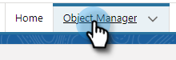

# Motivos de chamada de registro e resultados de chamada para o Salesforce {#log-call-reasons-and-call-outcomes-to-salesforce}

Se você deseja registrar os resultados da chamada e chamar os motivos para o Salesforce para fins de relatório ou visibilidade, é possível criar um campo de atividade personalizado para cada um. Cada campo deve usar um Nome de API específico (conhecido como &quot;Nome de campo&quot; no Salesforce).

* Nome do Campo de Resultados da Chamada: mktosales_call_result
* Nome do campo Motivos da chamada: mktosales_call_reason

Para utilizar esses campos, primeiro será necessário criar o campo como um campo de atividade personalizado. Para torná-lo visível para os usuários, será necessário adicioná-lo ao layout da página do objeto da tarefa.

## Salesforce Classic {#salesforce-classic}

### Criar campo de atividade personalizado no Salesforce Classic  {#create-custom-activity-field-in-salesforce-classic}

1. No Salesforce, clique em **Configuração**.

   

1. Digite &quot;Atividades&quot; na caixa Localização rápida.

   

1. Clique em **Campos personalizados da atividade**.

   

1. Clique em **Novo**.

   

1. Selecione o tipo de dados &quot;Texto&quot; e clique em **Próximo**.

   

1. Forneça ao campo personalizado o nome do campo conforme definido acima. O comprimento do campo tem um limite de 255 caracteres. O Rótulo do campo será o campo visível para a sua equipe de vendas e poderá ser personalizado para atender às necessidades da sua equipe.

   

1. O restante das configurações são opcionais. Após concluir a configuração, clique em **Próximo**.

   

1. Selecione as configurações de segurança de nível de campo desejadas para este campo e clique em **Próximo** (a imagem abaixo é apenas um exemplo).

   

   >[!NOTE]
   >
   >Certifique-se de que o campo personalizado esteja visível para o perfil que seus usuários utilizam das Ações de insight de vendas, juntamente com qualquer outro lugar que você gostaria que ele ficasse visível.

1. Selecione os layouts de página aos quais você deseja adicionar o campo e clique em **Salvar** (opcionalmente, você pode clicar em **Salvar e Novo** e repita o processo para o campo Motivo da chamada ).

   

### Adicionar campo de atividade personalizado ao layout da página de tarefa no Salesforce Classic {#add-custom-activity-field-to-task-page-layout-in-salesforce-classic}

>[!NOTE]
>
>Você só precisará seguir essas etapas se não tiver selecionado o layout de página desejado na Etapa 9 acima.

1. No Salesforce, clique em **Configuração**.

   

1. Digite &quot;Tarefa&quot; na caixa Localização rápida.

   

1. Clique em **Layouts da Página de Tarefas**.

   

1. Clique em **Editar** ao lado do layout da página da tarefa, você deseja adicionar este campo.

   

1. Arraste e solte o campo até a seção desejada do layout da página Tarefa.

   

1. Clique em **Salvar**.

   

## Salesforce Lightning {#salesforce-lightning}

### Criar campo de atividade personalizado no Salesforce Lightning {#create-custom-activity-field-in-salesforce-lightning}

1. No Salesforce, clique no ícone de engrenagem na parte superior direita e selecione **Configuração**.

   

1. Clique em **Gerenciador de objetos**.

   

1. Digite &quot;Atividade&quot; na caixa Localização rápida.

   

1. Clique no botão **Atividade** rótulo.

   

1. Clique em **Campos e Relações**.

   

1. Clique em **Novo**.

   

### Adicionar campo de atividade personalizado ao layout da página de tarefa no Salesforce Lightning {#add-custom-activity-field-to-task-page-layout-in-salesforce-lightning}

1. No Salesforce, clique no ícone de engrenagem na parte superior direita e selecione **Configuração**.

   

1. Clique em **Gerenciador de objetos**.

   

1. Digite &quot;Tarefa&quot; na caixa Localização rápida.

   

1. Clique no botão **Tarefa** rótulo.

   

1. Clique em **Layouts de página**.

   

1. Clique no layout da página da tarefa à qual deseja adicionar este campo.

   

1. Arraste e solte o campo até a seção desejada do layout da página Tarefa.

   

1. Clique em **Salvar**.

   

>[!MORELIKETHIS]
>
>* [Resultados da chamada](/help/marketo/product-docs/marketo-sales-insight/actions/phone/call-outcomes.md)
>* [Motivos da chamada](/help/marketo/product-docs/marketo-sales-insight/actions/phone/call-reasons.md)

