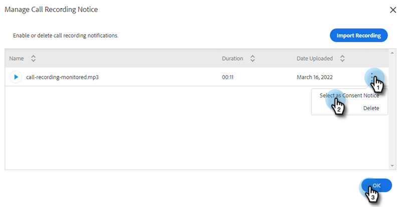

# Configurações de consentimento de dois participantes {#two-party-consent-settings}

Para garantir a conformidade com as leis de consentimento de duas partes dos EUA ao gravar chamadas, como administrador, você pode habilitar uma mensagem pré-gravada de sua escolha para ser reproduzida no início de suas chamadas, quando estiver sendo gravada.

>[!PREREQUISITES]
>
>Antes de seguir as etapas abaixo, primeiro você deve [habilitar a gravação de chamadas](/help/marketo/product-docs/marketo-sales-insight/actions/phone/enable-call-recording.md).

1. Clique no ícone Configurações e selecione **[!UICONTROL Configurações]**.

   

1. Em [!UICONTROL Configurações de Administração], clique em **[!UICONTROL Geral]**.

   

1. No cartão [!UICONTROL Gravação de Chamadas], clique em **[!UICONTROL Gerenciar aviso de gravação]**.

   

1. Clique em **[!UICONTROL Importar Gravação]**.

   

   >[!NOTE]
   >
   >Somente arquivos Wav e MP3 são suportados. Não é possível carregar um arquivo com mais de 30 segundos.

1. Selecione o(s) arquivo(s) de áudio desejado(s) no disco rígido.

   

1. Após concluir o carregamento, selecione os dados (três pontos) no gerenciador de arquivos e clique em **[!UICONTROL Selecionar como Aviso de Consentimento]**. Clique em **[!UICONTROL OK]** quando terminar.

   

1. Clique no botão de alternância para permitir que a mensagem selecionada seja reproduzida no início das chamadas gravadas.

   
