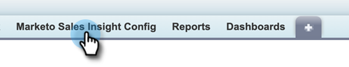

# Configuração de ações MSI no Salesforce {#msi-actions-configuration-in-salesforce}

>[!PREREQUISITES]
>
>* [Instalar]() ou [Atualizar]() Pacote de informações de vendas na sua instância do Salesforce Instalar/atualizar para o [Pacote de ações MSI](/help/marketo/product-docs/marketo-sales-insight/msi-for-salesforce/configuration/configure-marketo-sales-insight-in-salesforce-enterprise-unlimited.md) na sua instância do Salesforce.
>* [Configurar o Marketo Sales Insight no Salesforce Enterprise/Unlimited]()

## Adicionar novo local remoto no Salesforce {#add-new-remote-site-in-salesforce}

1. No Salesforce, clique em **Configuração**.

   

1. Procure por &quot;site remoto&quot; e selecione **Configurações de local remoto**.
   

1. Clique em **Novo local remoto**.

   

1. Insira o Nome do site remoto (pode ser algo como &quot;MarketoSalesInsight&quot;). Insira o URL do site remoto (https://ims-na1-stg1.adobelogin.com) e clique em **Salvar**.

   

## Ativar ações MSI no CRM {#enabling-msi-actions-across-the-crm}

1. No Salesforce, clique no botão **Configuração do Marketo Sales Insight** guia .

   

   >[!NOTE]
   >
   >Se você não vir a &quot;Configuração do Marketo Sales Insight&quot; na barra superior, clique no link **+** assine e encontre-o em Todas as guias.

1. Selecione o **Ativar ações MSI** caixa de seleção.

   

1. Insira a chave secreta da API.

   

   >[!NOTE]
   >
   >Se você não tiver a chave de segurança da API acessível, poderá encontrá-la seguindo as etapas em [este artigo](/help/marketo/product-docs/marketo-sales-insight/msi-for-salesforce/configuration/configure-marketo-sales-insight-in-salesforce-enterprise-unlimited.md).

1. Clique em **Salvar** quando concluído.

Isso habilitará automaticamente todos os recursos de Ações MSI descritos no artigo Visão geral dos recursos.

>[!NOTE]
>
>Você pode desativar todos os recursos de Ações MSI simplesmente desmarcando a caixa de seleção &quot;Ativar ações MSI&quot;.

## Governança de ações MSI {#msi-actions-governance}

1. Você pode desativar as Campanhas de vendas e/ou a guia Tarefa na próxima seção. Isso será aplicável aos painéis de lead, contato, conta e oportunidade.

   

1. Você pode desativar as Ações MSI desmarcando os recursos correspondentes em Configurações de ações.

   

>[!NOTE]
>
>As configurações de governança são aplicáveis a todos os usuários de MSI.
