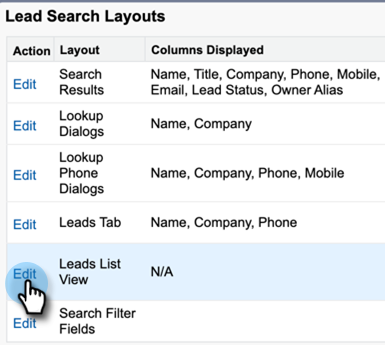

# Desinstalar Pacote de Personalização do Salesforce Classic {#uninstall-salesforce-classic-customization-package}

Desinstale o pacote Marketo Sales Connect em sua conta Salesforce depois de começar a usar o pacote MSI Actions.

## Remover campos da Conexão de Vendas do Layout da Página {#remove-sales-connect-fields-from-page-layout}

1. No Salesforce Classic, clique em **Configuração**.

   

1. Na navegação à esquerda, em Criar, expanda (mas não clique em) Personalizar e, em seguida, Leads. Em seguida, selecione **Layouts de página**.

   

1. Clique em **Editar** ao lado do Layout principal.

   

1. No console, selecione **Campos**. Em Localização Rápida, pesquise &quot;MSC&quot;. Todos os campos esmaecidos foram adicionados ao layout da página. Você terá que excluí-los.

   

   >[!NOTE]
   >
   >Se nenhum dos campos estiver acinzentado, significa que você não os adicionou ao layout da página. Você pode ignorar esta seção.

1. Role até a seção que tem seus campos personalizados de conexão de vendas.

   

1. Existem 10 tipos de campos MSC que podem ser adicionados a esta seção. Remova todos os campos adicionados ou exclua a seção inteira.

1. Clique em **Salvar rapidamente** quando concluído.

   

## Remover Botões de Conexão de Vendas dos Layouts de Página {#remove-sales-connect-buttons-from-page-layouts}

1. No console (Etapa 4 acima), selecione **Botões**. Pesquise &quot;MSC&quot;. Todos os botões esmaecidos foram adicionados à seção de botões personalizados. Você terá que excluí-los.

   

   >[!NOTE]
   >
   >Se nenhum dos botões estiver acinzentado, significa que você não os adicionou. Você pode ignorar esta seção.

1. Arraste e solte os botões do MSC da seção Botões Personalizados para o console.

   

1. Clique em **Salvar rapidamente** quando concluído.

   

## Remover Campos de Conexão de Vendas da Seção Histórico de Atividades {#remove-sales-connect-fields-from-activity-history-section}

1. Role até a parte inferior da página até a seção da lista relacionada ao Histórico de atividades e clique no ícone Fraca.

   

1. Selecione os Campos da Conexão de Vendas na área Campos Selecionados e clique na seta Remover. Clique em **OK** quando concluído.

   

   >[!NOTE]
   >
   >A abreviação MSE _é_ Conexão de Vendas É apenas o nome anterior, &quot;Marketo Sales Engage&quot;.

1. Clique em **Salvar** quando terminar com a página Leads.

## Remover Botões de Ação em Massa da Conexão de Vendas da Exibição de Lista de Clientes Potenciais {#remove-sales-connect-bulk-action-buttons-from-lead-list-view}

1. Na navegação à esquerda, em Criar, expanda (mas não clique em) Personalizar e, em seguida, Leads. Em seguida, selecione **Pesquisar Layouts**.

   

1. Ao lado da Exibição de lista de clientes potenciais, clique em **Editar**.

   

1. Selecionar **Adicionar à Campanha MSC (Clássica)**, **E-mail com MSC (Classic)** e **Encaminhar para MSC (Clássico)** e clique na seta Remover. Em seguida, clique em **Salvar**.

   

Você não deve mais ver os botões na exibição da lista de lead.

## Remover Configuração do MSC para Contatos {#remove-msc-configuration-for-contacts}

1. No Salesforce, clique em **Configuração**.

1. Na navegação à esquerda, em Criar, expanda (mas não clique em) Personalizar e, em seguida, em Contatos. Em seguida, selecione **Layouts de página**.

1. Ao lado de Layout do contato, clique em **Editar**.

1. Repita as etapas de todas as três seções.

## Remover Configuração do MSC para Oportunidade {#remove-msc-configuration-for-opportunity}

1. No Salesforce, clique em **Configuração**.

1. Na navegação à esquerda, em Criar, expanda (mas não clique em) Personalizar, em seguida, Oportunidades. Em seguida, selecione **Layouts de página**.

1. Ao lado de Layout da Oportunidade, clique em **Editar**.

1. Repita as etapas de todas as três seções.

A exibição da Oportunidade tem apenas um botão - &quot;Enviar Email MSE&quot; e os seguintes campos:

## Remover Configuração do MSC para Conta {#remove-msc-configuration-for-account}

1. No Salesforce, clique em **Configuração**.

1. Na navegação à esquerda, em Criar, expanda (mas não clique em) Personalizar, em seguida em Conta. Em seguida, selecione **Layouts de página**.

1. Ao lado do Layout da conta, clique em **Editar**.

1. Repita as etapas de todas as três seções.

A exibição de conta tem apenas um botão - &quot;Enviar email MSE&quot; e os seguintes campos:

## Remover Caixa de Saída de Vendas da Marketo {#remove-marketo-sales-outbox}

1. No Salesforce, clique no botão **+** na parte superior da tela.

1. Clique em **Personalizar Minhas Guias**.

1. Selecione a opção Caixa de saída de vendas do Marketo à direita. Clique na seta Remover e, em seguida, clique em **Salvar**.

## Excluir Pacote de Conexão de Vendas {#delete-sales-connect-package}

Depois de remover todos os objetos de sua conta do Salesforce, siga as etapas abaixo.

1. No Salesforce, clique em **Configuração**.

1. Na caixa Localização Rápida, digite &quot;Classes de Apex&quot;.

1. Clique em **Excluir** ao lado de todas as entradas &quot;MarketoSalesConnectionCustomization&quot; ou &quot;MarketoSalesEngageCustomization&quot; na lista.

Está tudo pronto!

Aqui está uma lista de todos os objetos que precisam ser removidos da instância do Salesforce:

## Detalhes de Personalização da Conexão de Vendas {#sales-connect-customization-details}

<table>
 <tr>
  <th>Campos de atividades personalizadas</th>
  <th>Descrição</th>
  <th>Tipo</th>
  <th>Tipo de dados</th>
 </tr>
 <tr>
  <td>ID de Presença Local da Chamada MSC</td>
  <td>Como usuário, posso escolher Presença local como opção quando faço chamadas do MSC Phone. As chamadas recebidas mostrarão um número local para o receptor</td>
  <td>Atividade</td>
  <td>Texto</td>
 </tr>
 <tr>
  <td>URL de Gravação de Chamada do MSC</td>
  <td>As chamadas podem ser registradas e um link para a gravação será registrado aqui </td>
  <td>Atividade</td>
  <td>Texto</td>
 </tr>
 <tr>
  <td>Campanha MSC</td>
  <td>Nome do registro da campanha MSC na qual o contato/cliente potencial está ativado</td>
  <td>Atividade</td>
  <td>Texto</td>
 </tr>
 <tr>
  <td>URL da Campanha MSC</td>
  <td>Registra o URL da campanha criada no MSC. Clicar nisso abrirá a campanha no aplicativo web MSC</td>
  <td>Atividade</td>
  <td>Texto</td>
 </tr>
 <tr>
  <td>Etapa atual da campanha MSC</td>
  <td>Se um contato/lead estiver em uma campanha, esse campo registrará o nome da etapa em que está no momento</td>
  <td>Atividade</td>
  <td>Caixa de seleção</td>
 </tr>
 <tr>
  <td>Anexo de Email do MSC Visualizado</td>
  <td>Registra dados quando um email é enviado com um anexo visualizado pelo recipient</td>
  <td>Atividade</td>
  <td>Caixa de seleção</td>
 </tr>
 <tr>
  <td>Email do MSC Clicado</td>
  <td>Registra uma marca de seleção quando o recipient clica em um link no email</td>
  <td>Atividade</td>
  <td>Caixa de seleção</td>
 </tr>
 <tr>
  <td>Email do MSC Respondido</td>
  <td>Registra uma marca de verificação quando o recipient responde ao email</td>
  <td>Atividade</td>
  <td>Texto</td>
 </tr>
 <tr>
  <td>Status de Email do MSC</td>
  <td>Mostra se um email é enviado/em andamento/devolvido (o rastreamento de emails devolvidos depende do canal de delivery usado)</td>
  <td>Atividade</td>
  <td>Texto</td>
 </tr>
 <tr>
  <td>Modelo de Email MSC</td>
  <td>Nome do registro do modelo MSC usado no email enviado para o cliente potencial/contato</td>
  <td>Atividade</td>
  <td>Texto</td>
 </tr>
 <tr>
  <td>URL do Modelo de Email MSC</td>
  <td>Registra o URL para o modelo criado no MSC. Clicar nisso abrirá o modelo no aplicativo web do MSC</td>
  <td>Atividade</td>
  <td>Texto</td>
 </tr>
 <tr>
  <td>URL de Email do MSC</td>
  <td>Clicar neste URL abrirá a central de comando no MSC e puxará a guia Histórico da Exibição de Detalhes de Pessoas, onde o usuário pode ver o email enviado</td>
  <td>Atividade</td>
  <td>Texto</td>
 </tr>
 <tr>
  <td>Emails da MSC Visualizados</td>
  <td>Registra uma marca de verificação quando o recipient exibe um email</td>
  <td>Atividade</td>
  <td>Caixa de seleção</td>
 </tr>
</table>

<table>
 <tr>
  <th>Campo de Registro de Rolagem do MSC</th>
  <th>Descrição</th>
  <th>Tipo</th>
  <th>Tipo de dados</th>
 </tr>
 <tr>
  <td>MSC - Último compromisso de marketing</td>
  <td>Último envolvimento recebido do Marketing</td>
  <td>
  
Conta 
  
Contato 
  
Lead 
  
Oportunidade</td>
  <td>Dados e hora</td>
 </tr>
 <tr>
  <td>MSC - Data do Último Envolvimento de Marketing</td>
  <td>Carimbo de data e hora do envolvimento do Marketing</td>
  <td>
  
Conta 
  
Contato 
  
Líder 
  
Oportunidade</td>
  <td>Dados e hora</td>
 </tr>
 <tr>
  <td>MSC - Desc do último compromisso de marketing</td>
  <td>Descrição do compromisso</td>
  <td>
  
Conta 
  
Contato 
  
Líder 
  
Oportunidade</td>
  <td>Texto</td>
 </tr>
 <tr>
  <td>MSC - Última origem do compromisso de marketing</td>
  <td>Fonte do envolvimento de marketing</td>
  <td>
  
Conta 
  
Contato 
  
Líder 
  
Oportunidade</td>
  <td>Texto</td>
 </tr>
 <tr>
  <td>MSC - Tipo de Último Envolvimento de Marketing</td>
  <td>Tipo de envolvimento (por exemplo: Atividade da Web)</td>
  <td>
  
Conta 
  
Contato 
  
Líder 
  
Oportunidade</td>
  <td>Texto</td>
 </tr>
 <tr>
  <td>MSC - Última Atividade por Vendas</td>
  <td>Última atividade de saída executada pela equipe de vendas</td>
  <td>
  
Conta 
  
Contato 
  
Líder 
  
Oportunidade</td>
  <td>Dados e hora</td>
 </tr>
 <tr>
  <td>MSC - Última Resposta</td>
  <td>Última resposta de email ao email de Vendas</td>
  <td>
  
Conta 
  
Contato 
  
Líder 
  
Oportunidade</td>
  <td>Dados e hora</td>
 </tr>
 <tr>
  <td>MSC - Campanha de Vendas Atual</td>
  <td>Nome do registro da campanha MSC na qual o contato/cliente potencial está ativado</td>
  <td>
  
Conta 
  
Contato 
  
Líder 
  
Oportunidade</td>
  <td>Texto</td>
 </tr>
 <tr>
  <td>MSC - Último compromisso de vendas</td>
  <td>Último compromisso recebido das Vendas</td>
  <td>
  
Conta 
  
Contato 
  
Líder 
  
Oportunidade</td>
  <td>Dados e hora</td>
 </tr>
 <tr>
  <td>MSC - Não participação</td>
  <td>Campo Recusar</td>
  <td>
  
Conta 
  
Contato 
  
Líder 
  
Oportunidade</td>
  <td>Caixa de seleção</td>
 </tr>
</table>

<table>
 <tr>
  <th>Botões MSC</th>
  <th>Descrição</th>
  <th>Tipo</th>
 </tr>
 <tr>
  <td>Enviar Email do MSC</td>
  <td>Enviar emails de vendas do Salesforce</td>
  <td>
  
Conta 
  
Contato 
  
Líder 
  
Oportunidade</td>
 </tr>
 <tr>
  <td>Adicionar à Campanha MSC</td>
  <td>Adicionar às campanhas MSC do Salesforce</td>
  <td>
  
Contato
  
Líder</td>
 </tr>
 <tr>
  <td>Encaminhar para MSC</td>
  <td>Encaminhar contato do Salesforce para o MSC</td>
  <td>
  
Contato
  
Líder</td>
 </tr>
 <tr>
  <td>Chame com MSC</td>
  <td>Efetuar chamadas de vendas do Salesforce</td>
  <td>
  
Contato
  
Líder</td>
 </tr>
</table>

<table>
 <tr>
  <th>Botões de Ação em Massa do MSC</th>
  <th>Descrição</th>
  <th>Tipo</th>
 </tr>
 <tr>
  <td>Adicionar à Campanha MSC (Clássica)</td>
  <td>Adicionar às campanhas MSC do Salesforce</td>
  <td>
  
Contato
  
Líder</td>
 </tr>
 <tr>
  <td>Encaminhar para MSC (Clássico)</td>
  <td>Encaminhar contato do Salesforce para o MSC</td>
  <td>
  
Contato
  
Líder</td>
 </tr>
 <tr>
  <td>E-mail com MSC (Classic)</td>
  <td>E-mail com MSC do Salesforce</td>
  <td>
  
Contato
  
Líder</td>
 </tr>
</table>
