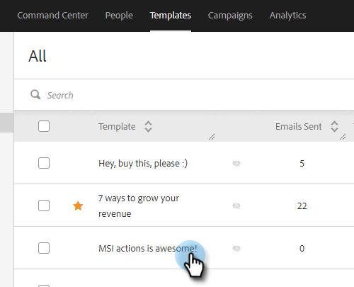
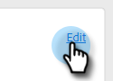
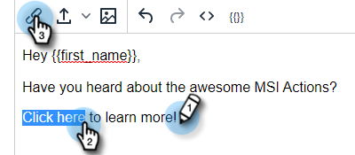

# Adicionar texto com hiperlink {#add-hyperlinked-text}

Siga as etapas abaixo para saber como adicionar hiperlinks aos seus modelos de email.

1. Na página [!UICONTROL Modelos], selecione o modelo desejado (ou crie um novo).

   

1. Clique em **[!UICONTROL Editar]**.

   

1. Digite o texto que deseja vincular por hiperlink (ou seja, &quot;Clique aqui&quot;). [!DNL Highlight] e clique no botão de link no editor.

   

1. Insira a URL à qual você deseja que ela seja vinculada (ou seja, `https://experienceleague.adobe.com/docs/marketo/using/home.html?lang=pt-BR`). Escolha se deseja que a URL seja aberta na mesma janela ou em uma nova janela e clique em **[!UICONTROL Salvar]**.

   

1. Clique em **[!UICONTROL Salvar]** novamente.

   

>[!NOTE]
>
>Se o template editado estiver sendo usado atualmente como uma etapa de email em qualquer campanha, você terá a opção de atualizar o texto para campanhas específicas (ou todas).
