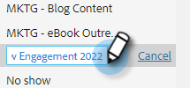

# Gerenciar categorias de modelo {#manage-template-categories}

## Criar uma categoria {#create-a-category}

1. Clique na guia **[!UICONTROL Modelos]**.

   

1. Clique no ícone **+** ao lado de **[!UICONTROL Categorias]**.

   

1. Insira um nome para a nova categoria e clique em **[!UICONTROL Criar]**.

   

## Renomear uma categoria de modelo {#rename-a-template-category}

1. Clique na guia **[!UICONTROL Modelos]**.

   

1. Passe o mouse sobre o modelo que deseja renomear e clique nos dados (três pontos). Selecione **[!UICONTROL Renomear]**.

   

1. Digite o novo nome. Pressione Enter (ou apenas clique em outro lugar na tela) para salvar.

   

## Excluir uma categoria de modelo {#delete-a-template-category}

1. Clique na guia **[!UICONTROL Modelos]**.

   

1. Passe o mouse sobre o modelo que deseja renomear e clique nos dados (três pontos). Clique em **[!UICONTROL Excluir]**.

   

1. Clique em **[!UICONTROL Excluir]** para confirmar.

   

>[!NOTE]
>
>As categorias não podem ser excluídas se contiverem modelos. Mova ou exclua todos os modelos antes de excluir uma categoria.
