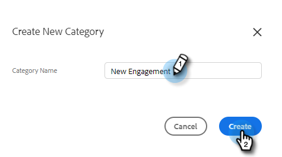
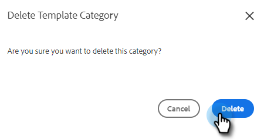

# Gerenciar Categorias de Modelos {#manage-template-categories}

## Criar uma categoria {#create-a-category}

1. Clique no botão **Modelos** guia .

   

1. Clique no botão **+** ícone ao lado de **Categorias**.

   

1. Insira um nome para a nova categoria e clique em **Criar**.

   

## Renomear uma categoria de modelo {#rename-a-template-category}

1. Clique no botão **Modelos** guia .

   

1. Passe o mouse sobre o modelo que deseja renomear e clique no dota (três pontos). Selecionar **Renomear**.

   

1. Digite o novo nome. Pressione Enter (ou apenas clique em outro lugar na tela) para salvar.

   

## Excluir uma categoria de modelo {#delete-a-template-category}

1. Clique no botão **Modelos** guia .

   

1. Passe o mouse sobre o modelo que deseja renomear e clique no dota (três pontos). Selecionar **Excluir**.

   

1. Clique em **Excluir** para confirmar.

   

>[!NOTE]
>
>As categorias não podem ser excluídas se ainda tiverem modelos. Mova ou exclua todos os modelos antes de excluir uma categoria.
