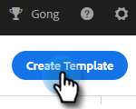

# Gerenciar modelos {#manage-templates}

## Criar um modelo {#create-a-new-template}

1. Navegue até a guia **[!UICONTROL Modelos]**.

   

1. Clique em **[!UICONTROL Criar Modelo]**.

   

1. Escolha um **[!UICONTROL Nome]** e uma **[!UICONTROL Categoria]** para o modelo de email e clique em **[!UICONTROL Criar]**.

   

1. No editor de modelos, crie uma linha de assunto para o email e digite a mensagem desejada. Use as ferramentas de edição (fonte, tamanho do texto etc.) para personalizar a aparência. Clique em **[!UICONTROL Salvar]** para finalizar as alterações.

   

>[!TIP]
>
>Sempre digite o texto diretamente no modelo ou copie de um editor de texto simples (por exemplo, [!DNL Notepad] ou [!DNL TextEdit]). Copiar e colar de um editor de rich text (por exemplo, MS [!DNL Word]) pode causar irregularidades na formatação.

## Exibir Detalhes do Modelo {#view-template-details}

A área Detalhes do modelo contém várias guias.

<table>
 <tr>
  <td><strong>[!UICONTROL Modelo]</strong></td>
  <td>Revise e faça edições, configure critérios para tornar o modelo um modelo recomendado e adicione observações</td>
 </tr>
 <tr>
  <td><strong>Analytics</strong></td>
  <td>Revise as análises de envolvimento para o modelo. Executar uma pesquisa filtrada.</td>
 </tr>
 <tr>
  <td><strong>[!UICONTROL Emails]</strong></td>
  <td>Exibir todos os emails enviados usando este modelo. Executar uma pesquisa filtrada.</td>
 </tr>
 <tr>
  <td><strong>[!UICONTROL Campanhas]</strong></td>
  <td>Veja em quais campanhas o modelo está sendo usado.</td>
 </tr>
</table>

## Compartilhar um modelo {#share-a-template}

Se você estiver usando uma de nossas contas da equipe, todos os seus modelos ainda serão privados por padrão.

1. Navegue até a guia **[!UICONTROL Modelos]**.

   

1. Localize e escolha o modelo desejado.

   

1. Clique no botão **[!UICONTROL Compartilhar]**.

   

   >[!NOTE]
   >
   >Os modelos que foram compartilhados com você serão exibidos no cabeçalho **[!UICONTROL Modelos de Equipe]** à esquerda da página [!UICONTROL Modelos]. As equipes só estão disponíveis para usuários Premium.

1. Clique no menu suspenso [!UICONTROL Compartilhar com] e selecione as equipes com as quais você deseja compartilhar.

   

1. Você tem a opção de manter o modelo na categoria atual ou movê-lo para uma categoria diferente. Neste exemplo, estamos mantendo-o no atual. Clique em **[!UICONTROL Compartilhar]** quando terminar.

   

## Marcar um modelo como favorito {#favorite-a-template}

É possível adicionar modelos de qualquer categoria à lista Favoritos. Isso gera automaticamente uma nova categoria na parte superior da lista para que você possa acessar rapidamente os modelos que mais usa.

1. Navegue até a guia **[!UICONTROL Modelos]**.

   

1. Localize o modelo desejado e passe o mouse sobre ele. Clique na estrela que aparece à esquerda do nome do modelo.

   

   Depois de ser escolhida como favorita, a estrela permanecerá.

   

## Personalizar exibição de modelo {#customize-template-view}

No menu suspenso **[!UICONTROL Exibir]**, você pode optar por ver: todos os modelos, seus modelos, modelos favoritos, compartilhados, não compartilhados ou não usados (modelos que não foram usados nos últimos 90 dias).

>[!NOTE]
>
>Além disso, você pode adicionar/remover colunas na visualização de modelo clicando no ícone de configurações à direita do menu suspenso de visualização.

## Arquivar um modelo {#archive-a-template}

Arquive modelos para manter o conteúdo de vendas organizado e focalizado sem perder nenhum dado de modelo.

1. Marque a caixa ao lado do modelo que deseja arquivar.

   

1. Clique em **[!UICONTROL Arquivar]**.

   

1. Clique em **[!UICONTROL Arquivar]** para confirmar.

   

>[!NOTE]
>
>Depois que um modelo é arquivado, ele não pode ser editado ou usado. Para usá-lo novamente, mova o modelo para fora de Arquivar e para qualquer outra categoria.

Você também pode selecionar o filtro Não usado para exibir e arquivar modelos que não são usados há mais de 90 dias.

## Excluir um modelo {#delete-a-template}

Siga as etapas abaixo para excluir um modelo.

>[!CAUTION]
>
>A exclusão de um modelo também excluirá TODO o rastreamento e as análises associadas a ele.

1. Marque a caixa ao lado do modelo que deseja excluir.

   

1. Clique em **[!UICONTROL Excluir]**.

   

1. Clique em **[!UICONTROL Excluir]** para confirmar.

   
