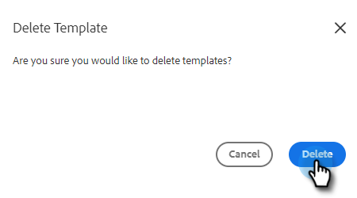

# Gerenciar modelos {#manage-templates}

## Criar um modelo {#create-a-new-template}

1. Navegue até o **Modelos** guia .

   

1. Clique em **Criar modelo**.

   

1. Escolha um **Nome** e **Categoria** para seu modelo de email, clique em **Criar**.

   

1. No editor de modelos, crie uma linha de assunto para seu email e digite a mensagem desejada. Use as ferramentas de edição (fonte, tamanho do texto etc.) para personalizar a aparência. Clique em **Salvar** para finalizar as alterações.

   

>[!TIP]
>
>Sempre digite texto diretamente no modelo ou copie de um editor de texto simples (por exemplo, Bloco de notas ou Edição de texto). Copiar e colar de um editor de rich text (por exemplo, MS Word) pode causar irregularidades na formatação.

## Exibir detalhes do modelo {#view-template-details}

A área Detalhes do modelo contém várias guias.

<table>
 <tr>
  <td><strong>Modelo</strong></td>
  <td>Revise e faça edições, configure critérios para tornar o modelo um modelo recomendado, adicione observações</td>
 </tr>
 <tr>
  <td><strong>Análises</strong></td>
  <td>Analise as análises de envolvimento do modelo. Realize uma pesquisa filtrada.</td>
 </tr>
 <tr>
  <td><strong>E-mails</strong></td>
  <td>Exibir todos os emails que foram enviados usando esse template. Realize uma pesquisa filtrada.</td>
 </tr>
 <tr>
  <td><strong>Campanhas</strong></td>
  <td>Veja em quais Campanhas o modelo está sendo usado.</td>
 </tr>
</table>

## Compartilhar um modelo {#share-a-template}

Se você estiver usando uma de nossas contas de equipe, todos os modelos ainda serão privados por padrão.

1. Navegue até o **Modelos** guia .

   

1. Localize e escolha o modelo desejado.

   

1. Clique no botão **Compartilhar** botão.

   

   >[!NOTE]
   >
   >Os modelos que foram compartilhados com você serão exibidos no **Modelos de equipe** no lado esquerdo da página Modelos. As equipes só estão disponíveis para usuários do Premium.

1. Clique no menu suspenso Compartilhar com e selecione as equipes com as quais deseja compartilhar.

   

1. Você tem a opção de manter o modelo na categoria atual ou movê-lo para um diferente. Neste exemplo, nós o mantemos no atual. Clique em **Compartilhar** quando concluído.

   

## Adicionar um modelo como favorito {#favorite-a-template}

Você pode adicionar modelos de qualquer categoria à sua lista de Favoritos. Isso gera automaticamente uma nova categoria na parte superior da lista, para que você possa acessar rapidamente os modelos que mais usa.

1. Navegue até o **Modelos** guia .

   

1. Encontre o modelo desejado e passe o mouse sobre ele. Clique na estrela que aparece à esquerda do nome do modelo.

   

   Depois de ser favorita, a estrela ficará.

   

## Personalizar exibição de modelo {#customize-template-view}

No **Exibir** , você pode optar por ver: todos os modelos, seus modelos, modelos favoritos, modelos compartilhados, modelos não compartilhados ou modelos não utilizados (modelos que não foram usados nos últimos 90 dias).

>[!NOTE]
>
>Além disso, é possível adicionar/remover colunas na exibição de modelo clicando no ícone de configurações à direita do menu suspenso de exibição.

## Arquivar um modelo {#archive-a-template}

Arquive modelos para manter o conteúdo de vendas organizado e focalizado, sem perder os dados do modelo.

1. Marque a caixa ao lado do template que deseja arquivar.

   

1. Clique em **Arquivar**.

   

1. Clique em **Arquivar** para confirmar.

   

>[!NOTE]
>
>Depois que um modelo é arquivado, ele não pode ser editado ou usado. Para usá-lo novamente, mova o modelo para fora do Arquivo e para qualquer outra categoria.

Você também pode selecionar o filtro Não usado para exibir e arquivar modelos que não foram usados em mais de 90 dias.

## Excluir um modelo {#delete-a-template}

Siga as etapas abaixo para excluir um modelo.

>[!CAUTION]
>
>A exclusão de um modelo também excluirá TODO o rastreamento e as análises associadas a ele.

1. Marque a caixa ao lado do template que deseja excluir.

   

1. Clique em **Excluir**.

   

1. Clique em **Excluir** para confirmar.

   
