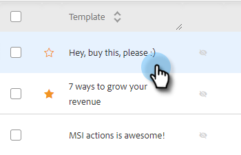

# Modelos recomendados {#recommended-templates}

Os Modelos recomendados de ação do Sales Insight ajudam você a obter as mensagens certas enquanto economiza seu tempo. Isso proporciona maior fluxo ao enviar emails e reduz a incerteza ao tentar encontrar o email certo para a pessoa certa.

1. Vá para a guia Templates.

   

1. Selecione o template que gostaria de recomendar.

   

1. No cartão Modelo recomendado, clique em **Editar**.

   

1. Marque a caixa de seleção **Criar um Modelo Recomendado** e clique em **Salvar**.

   

>[!NOTE]
>
>Para saber mais sobre os critérios do modelo, veja abaixo.

## Todos vs. Qualquer um {#all-vs-any}

Selecione **Todos** se quiser que o modelo seja recomendado quando todos os critérios forem atendidos. Selecione **Qualquer** se desejar que o modelo seja recomendado quando qualquer um dos critérios for atendido.

## Definição de critérios {#setting-criteria}

Seus critérios vão definir as condições para as quais os modelos serão recomendados. É possível definir no máximo 3 critérios. Primeiro, selecione os Campos dinâmicos que deseja apontar no modelo.

## Condições {#conditions}

Agora, selecione sua condição. Quando suas condições para o campo dinâmico forem atendidas, o template será recomendado. Escolha entre 4 condições diferentes.

**Igual a**: o valor deve ser uma correspondência exata (por exemplo, Marketo é igual a Marketo)

**Não é igual**: o valor deve ser qualquer item menos uma correspondência exata (por exemplo, a Nação de Marketing não é igual a Marketing)

**Contém**: só precisa conter o valor (por exemplo, Marketo Rocks! contém Marketo)

**Não Contém**: o valor não deve estar no campo dinâmico (por exemplo, Marketo Rocks! não contém Awesome)

## Como Se Parece Um Modelo Recomendado {#what-a-recommended-template-looks-like}

Agora que você mapeou seu primeiro modelo, é hora de mapear o restante. Percorra seus modelos mais bem-sucedidos e os recomende. Não se esqueça de compartilhar o modelo com sua equipe também. As configurações recomendadas para qualquer modelo também serão compartilhadas com a equipe.
