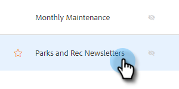

# Utilização do HTML {#using-html}

1. Copie o código-fonte de seus emails na ferramenta usada para criar emails no HTML (por exemplo, o Editor de email do Marketo).

1. Selecione o modelo ao qual deseja adicionar o HTML.

   

1. No cartão Editor de modelos, clique em **Editar**.

   

1. Clique no botão **Source** no editor de modelo.

   

1. Cole o código-fonte e clique em **Salvar**.

   

>[!NOTE]
>
>Se você vir o erro &quot;Erro - para remover as tags style/java/html&quot;, significa que você tem algum estilo não compatível. Você deve procurar o código Source para o estilo da palavra e excluir tudo de ``.
