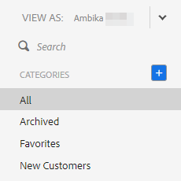

# Exibir a lista de modelos como outro usuário {#view-template-list-as-another-user}

Como administrador, você pode visualizar os modelos como qualquer usuário.

>[!NOTE]
>
>**Permissões de administrador são necessárias**

1. Clique em **[!UICONTROL Modelos]**.

   

1. Clique no menu suspenso **[!UICONTROL Exibir como]** e selecione o usuário desejado.

   

1. Agora você está visualizando modelos como o usuário selecionado.

   

   >[!NOTE]
   >
   >Você também pode usar filtros ou a função de pesquisa com _[!UICONTROL Exibir como]_ para exibir o que é mais relevante para você.
