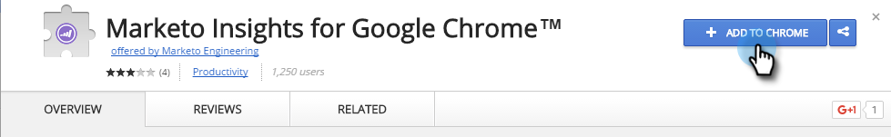

# Instalar o Marketo Insights para o Google Chrome {#install-marketo-insights-for-google-chrome}

Siga estas etapas para começar a usar o poderoso complemento Chrome.

>[!NOTE]
>
>Você não precisa ser um administrador do Marketo para instalar a extensão.

1. Instale o [Marketo Insights para o Google Chrome Add na extensão](https://chrome.google.com/webstore/detail/marketo-for-google-mail/jjkfbhajlmoeegbjgjipliamplidmbjb) na Chrome Web Store.

   

1. Clique com o botão direito do mouse no logotipo do Marketo no Chrome e selecione **Opções**.

   

1. Insira seu **Código Reg**, **Endereço de email**, **Nome** e **Sobrenome**. Clique em **Verificar e salvar**.

   

   >[!CAUTION]
   >
   >Certifique-se de usar seu **conta de email primária** ao registrar-se, já que não oferecemos suporte ao uso de aliases para este plug-in.

   >[!NOTE]
   >
   >O código Reg estará no email enviado após um Marketo Admin [emite uma licença do complemento de email do Marketo](/help/marketo/product-docs/marketo-sales-insight/msi-outlook-plugin/issue-a-marketo-email-add-in-license.md) [.](https://docs.marketo.com/pages/viewpage.action?pageid=7510848) **Ela expira após 14 dias**.

1. Clique em **Permitir** para permitir acesso offline.

   

>[!MORELIKETHIS]
>
>[Uso do Marketo Insights para o Google Chrome](/help/marketo/product-docs/marketo-sales-insight/msi-chrome-plugin/using-marketo-insights-for-google-chrome.md)
