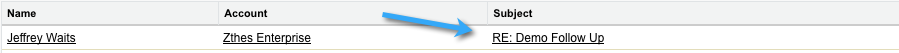

# Uso do Marketo Insights para o Google Chrome {#using-marketo-insights-for-google-chrome}

Envie e rastreie qualquer email do Google com o Marketo Insights para o Google Chrome.

>[!PREREQUISITES]
>
>[Instalar o Marketo Insights para o Google Chrome](/help/marketo/product-docs/marketo-sales-insight/msi-chrome-plugin/install-marketo-insights-for-google-chrome.md)

## Enviar um email com o Marketo Insights {#send-an-email-with-marketo-insights}

1. Na janela Compor, clique no ícone Marketo .

   

1. O botão Enviar tornou o Marketo roxo! Esse email agora será enviado com o Marketo, todos os links serão rastreados e um pixel de rastreamento será inserido no email. Isso será registrado como uma atividade Enviar email de vendas .

   

   >[!NOTE]
   >
   >Um pixel de rastreamento permite saber quem abriu o email.

   >[!TIP]
   >
   >Como opção, clique na seta dupla para expandir para uma visualização em tela cheia.

1. Se desejar preencher previamente seu email com um modelo do Marketo publicado, clique em **Mais opções** e selecione **Carregar modelo do Marketo**.

   

1. Selecione um **Modelo disponível** e clique em **Ok**.

   

1. Insira seu conteúdo, um endereço de email e clique em **Enviar**.

   

   >[!NOTE]
   >
   >As mensagens são rastreadas somente quando a variável **Enviar** botão é roxo.

1. O email será exibido em breve no Marketo Sales Insight e as aberturas e cliques serão rastreados.

   

## Registrar respostas de email com o Marketo {#log-email-replies-with-marketo}

Você pode registrar respostas e atividades antigas no histórico de atividades de um cliente potencial.

1. No painel de visualização do Google Mail, clique em **Faça logon com o Marketo**.

   

1. Isso é tudo! O email será exibido em breve no Marketo Sales Insight.

   

   >[!MORELIKETHIS]
   >
   >* [Instalar o Marketo Insights para o Google Chrome](/help/marketo/product-docs/marketo-sales-insight/msi-chrome-plugin/install-marketo-insights-for-google-chrome.md)
   >* [Exibir informações de pessoa e conta e atividades no Google Mail](/help/marketo/product-docs/marketo-sales-insight/msi-chrome-plugin/view-person-and-account-information-and-activities-in-google-mail.md)

