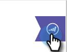

# Exibir informações e atividades de pessoas e contas no Google Mail {#view-person-and-account-information-and-activities-in-google-mail}

## Exibir atividades no Google Mail {#view-activities-in-google-mail}

Use o painel contextual do Marketo Insights para ver informações da conta e atividades recentes.

O painel é exibido no painel de leitura normal do Google Mail para a Caixa de entrada e itens enviados, e mostra informações e atividades da pessoa que enviou o email que você está lendo (ou para quem você enviou o email para os itens da pasta Enviados).

A guia Atividade da pessoa exibe informações relevantes sobre a pessoa, como nome, cargo, imagem e assim por diante. Você também pode ver as atividades mais recentes que ocorreram após o envio de um email, como visitar uma página da Web, preencher um formulário, clicar em um link, participar de um evento e abrir um email.

A guia Atividade da conta exibe informações relevantes da conta, como nome da empresa, URL do site e local. A guia também exibe as atividades mais recentes da conta. A conta é identificada pelo domínio de pessoa. As atividades serão exibidas na lista se algum usuário do Sales Insight em sua assinatura tiver correspondência com elas.

Se sua equipe nunca tiver trocado um email de vendas com a pessoa, nenhuma atividade será exibida.

Clique no ícone para recolher o painel.

Clique no ícone do Marketo para expandir o painel.

## Exibir atividades em [!DNL Google Chrome] {#view-activities-in-google-chrome}

Você também pode usar o Painel de Atividade Global no [!DNL Google Chrome] para ver uma lista completa das atividades mais recentes que ocorreram para todas as pessoas às quais você se correspondeu recentemente. Este é um feed atualizado em tempo real que exibe continuamente o número de atividades não lidas no ícone.

Clique no ícone do Marketo para abrir o painel.

>[!MORELIKETHIS]
>
>[Usando o Marketo Insights para [!DNL Google Chrome]](/help/marketo/product-docs/marketo-sales-insight/msi-chrome-plugin/using-marketo-insights-for-google-chrome.md)
